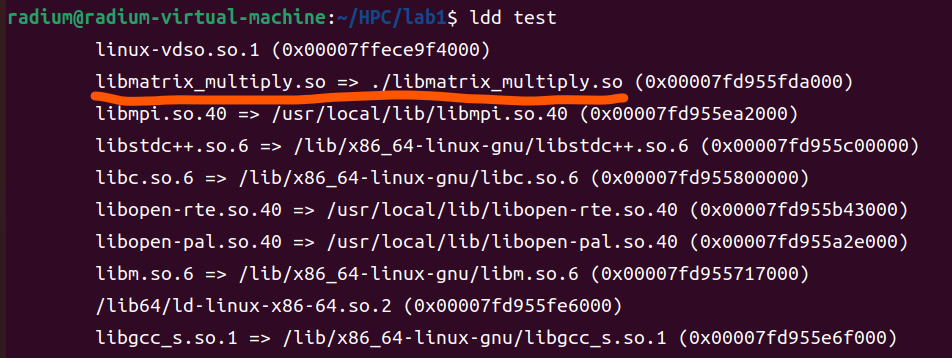
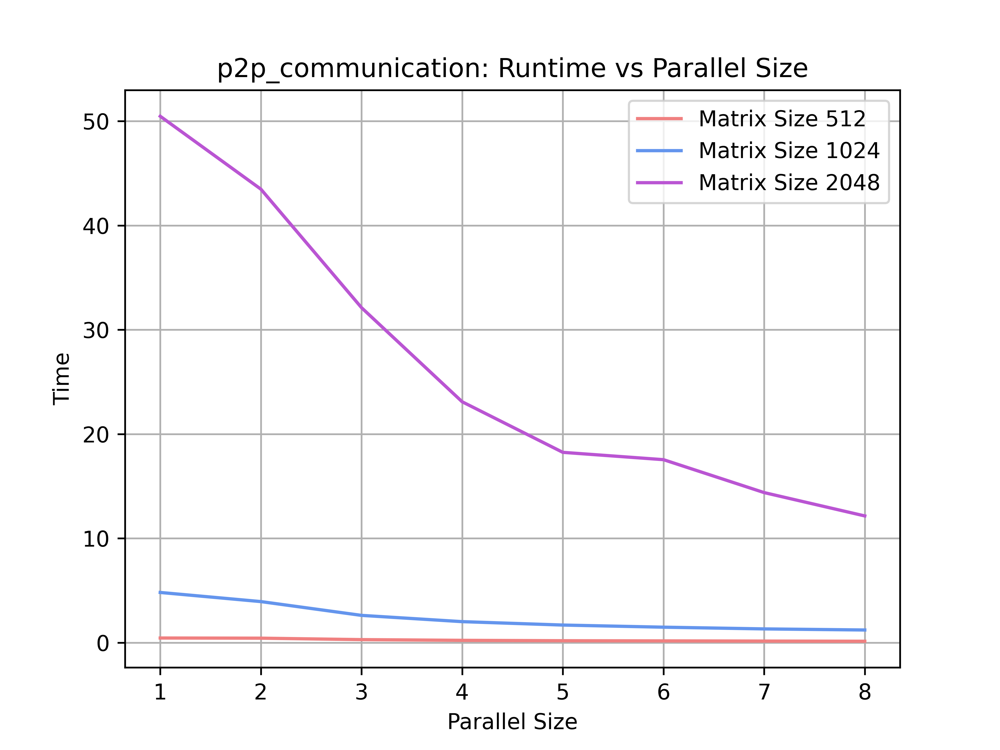
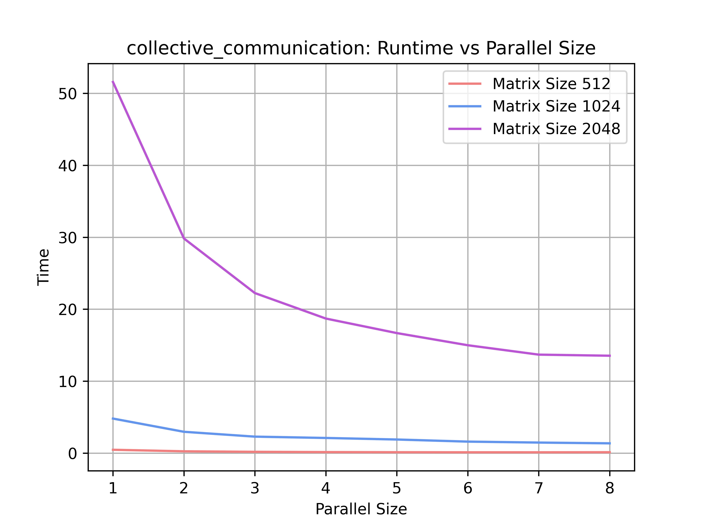
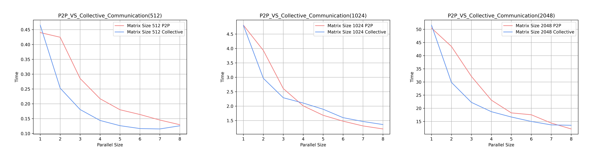
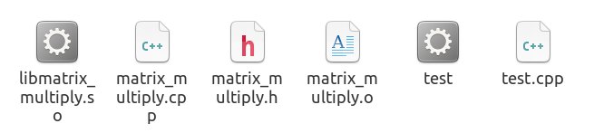

# <center> HPC Lab1-MPI

## 1. 实验目的
- 掌握MPI

## 2. 实验过程和核心代码
1. 通过MPI点对点通信的方式实现通用矩阵乘法
    1. 读取输入矩阵大小 `a`: m * n, `b`: n * k
    ```cpp
    int m, n, k;
    // read size of input matrix
    m = atoi(argv[1]);
    n = atoi(argv[2]);
    k = atoi(argv[3]);
    ```
    2. mpi初始化
    ``` cpp
    int rank, size, block;
    MPI_Init(NULL, NULL);
    MPI_Comm_rank(MPI_COMM_WORLD, &rank);
    MPI_Comm_size(MPI_COMM_WORLD, &size);
    block = m / size;                  // calculate 'block' rows in A in each thread
    double* b = new double[n * k];
    double* ans = new double[m * k];   // store answer in each thread
    ```
    3. 主进程（rank为0）首先生成随机矩阵，之后开始计时，用`MPI_Send`将矩阵A按`block`单位一个一个发送到其他进程，之后以同样的方式发送整个矩阵B到其他进程，之后处理剩余的行，因为 `m` 可能无法整除 `block`，最后把各个进程的结果汇总到矩阵C中
    ```cpp
    if (rank == 0) {
        // generate random matrix A & B
        ...
        // start
        double start = MPI_Wtime();
        // send the whole matrix B
        for (int i = 1; i < size; i++) {
            MPI_Send(b, n * k, MPI_DOUBLE, i, 0, MPI_COMM_WORLD);
        }
        // send the matrix A in 'block'
        for (int i = 1; i < size; i++) {
            MPI_Send(a + (i - 1) * block * n, n * block, MPI_DOUBLE, i, 1, MPI_COMM_WORLD);
        }
        // calculate the rest of A since m % size may not equal to 0
        for (int i = (size - 1) * block; i < m; i++) {
            for (int j = 0; j < k; j++) {
                double temp = 0;
                for (int t = 0; t < n; t++)
                    temp += a[i * n + t] * b[t * k + j];
                c[i * k + j] = temp;
            }
        }
        for (int t = 1; t < size; t++) {
            MPI_Recv(ans, block * k, MPI_DOUBLE, t, 3, MPI_COMM_WORLD, MPI_STATUS_IGNORE);
            for (int i = 0; i < block; i++) {
                for (int j = 0; j < k; j++) {
                    c[((t - 1) * block + i) * k + j] = ans[i * k + j];
                }
            }
        }
        double stop = MPI_Wtime();
        printf("running time: %lf s\n", stop - start);
    }
    ```
    4. 对于其他进程，利用`MPI_Recv`接收到分割后的矩阵后，按照普通的矩阵乘法计算即可，计算完之后利用`MPI_Send`发送回主进程
    ```cpp
    else {
        double* buffer = new double[n * block];

        MPI_Recv(b, n * k, MPI_DOUBLE, 0, 0, MPI_COMM_WORLD, MPI_STATUS_IGNORE);
        MPI_Recv(buffer, n * block, MPI_DOUBLE, 0, 1, MPI_COMM_WORLD, MPI_STATUS_IGNORE);
        for (int i = 0; i < block; i++) {
            for (int j = 0; j < k; j++) {
                double temp = 0;
                for (int t = 0; t < n; t++)
                    temp += buffer[i * n + t] * b[t * k + j];
                ans[i * k + j] = temp;
            }
        }
        MPI_Send(ans, block * k, MPI_DOUBLE, 0, 3, MPI_COMM_WORLD);

        delete[] buffer;
    }
    ```
    5. 终止mpi
    ```cpp
    MPI_Finalize();
    ```
    6. 执行：在命令行输入，其中 `-n` 表示进程数目，`512 512 512` 表示矩阵规模 `m`, `n`, `k`
    ```shell
    mpiexec -n 8 .\q1 512 512 512
    ```
2. 分别采用MPI点对点通信和MPI集合通信实现矩阵乘法中的进程之间通信，并比较两种实现方式的性能。尝试用 `mpi_type_create_struct` 聚合MPI进程内变量后通信
   1. MPI点对点通信（见上一问）
   2. MPI集合通信：可以看到我们需要使用 `for` 循环来不断地进行的 `MPI_Send` 来发送矩阵到其他进程进行矩阵运算，因此我们可以使用 `MPI_Scatter`，`MPI_Bcast`，`MPI_Gather` 搭配来实现集合通信
        1. 初始化与MPI点对点通信类似，不再赘述；对于主进程，类似的，将矩阵A按照 `block` 行一个单位发送到各个进程，之后将矩阵B通过 `MPI_Bcast` 广播到各个进程；其他进程计算后通过`MPI_Gather`收集每个进程的计算结果，最后汇总到矩阵C中
        ```cpp
        if (!rank) {
            srand((unsigned)time(0));
            // generate random matrix A & B
            for (int i = 0; i < m; i++) {
                for (int j = 0; j < n; j++) {
                    a[i * n + j] = (double)rand() / (double)(RAND_MAX) * 100;
                }
            }
            for (int i = 0; i < n; i++) {
                for (int j = 0; j < k; j++) {
                    b[i * k + j] = (double)rand() / (double)(RAND_MAX) * 100;
                }
            }
            // start
            start = MPI_Wtime();
            // scatter matrix A, each process get block lines of A
            MPI_Scatter(a, block * n, MPI_DOUBLE, buffer_a, block * n, MPI_DOUBLE, 
                        0, MPI_COMM_WORLD);
            // broadcast the whole matrix B to each process
            MPI_Bcast(b, n * k, MPI_DOUBLE, 0, MPI_COMM_WORLD);
            // gather 'ans' to 'c'
            MPI_Gather(ans, block * k, MPI_DOUBLE, c, block * k, MPI_DOUBLE, 0, MPI_COMM_WORLD);
            // calculate the rest of A since m % size may not equal to 0
            
            for (int i = (size - 1) * block; i < m; i++) {
                for (int j = 0; j < k; j++) {
                    double temp = 0;
                    for (int t = 0; t < n; t++)
                        temp += a[i * n + t] * b[t * k + j];
                    c[i * k + j] = temp;
                }
            }
            
            stop = MPI_Wtime();
            printf("running time: %lf s\n", stop - start);
        }
        ```
        2. 对于其他进程，同主进程的类似操作，只是操作的对象各自不同
        ```cpp
        else {
            double* buffer = new double[n * block]();
            MPI_Scatter(a, block * n, MPI_DOUBLE, buffer, block * n, MPI_DOUBLE, 
                        0, MPI_COMM_WORLD);
            MPI_Bcast(b, n * k, MPI_DOUBLE, 0, MPI_COMM_WORLD);
            for (int i = 0; i < block; i++) {
                for (int j = 0; j < k; j++) {
                    double temp = 0;
                    for (int t = 0; t < n; t++)
                        temp += buffer[i * n + t] * b[t * k + j];
                    ans[i * k + j] = temp;
                }
            }
            MPI_Gather(ans, block * k, MPI_DOUBLE, c, block * k, MPI_DOUBLE, 0, MPI_COMM_WORLD);
            delete[] buffer;
        }
        ```
   3. 采用 `mpi_type_create_struct` 聚合 mpi 进程内变量后进行通信（此处对点对点通信的代码进行进程内变量聚合，集合通信同理）
      1. 创建自己的变量类型，这里将每一部分行的矩阵A聚合为一个变量类型
        ```cpp
        // Create custom MPI datatype for sending matrix A
        MPI_Datatype blockType;
        MPI_Type_vector(block, n, n * size, MPI_DOUBLE, &blockType);
        MPI_Type_commit(&blockType);
        ```
      2. 在主进程，发送矩阵A时，即可用刚刚定义的 `blockType` 类型进行发送
        ```cpp
        // send the matrix A in 'block'
        for (int i = 1; i < size; i++) {
            MPI_Send(a + (i - 1) * block * n, 1, blockType, i, 1, MPI_COMM_WORLD);
        }
        ```
      3. 在其他进程，接收矩阵A的部分行时，也使用 `blockType` 类型进行接收
        ```cpp
        MPI_Recv(buffer, block, blockType, 0, 1, MPI_COMM_WORLD, MPI_STATUS_IGNORE);
        ```
3. 将Lab1的矩阵乘法改造为一个标准的库函数 `matrix_multiply`（函数实现文件和函数头文件）
   1. 构造头文件库 `matrix_multiply.h`，其中此处采用的矩阵输入类型为一维 `double` 数组，大小由 `m`, `n`, `k` 定义，最终返回计算时间
        ```cpp
        #ifndef MATRIX_MULTIPLY_H 
        #define MATRIX_MULTIPLY_H

        #include <stdio.h>
        #include <stdlib.h>
        #include <time.h>
        #include <mpi.h>

        double matrix_multiply(double* a, double* b, double* c, int m, int n, int k); 

        #endif
        ```
   2. 在 `matrix_multiply.cpp` 中实现详细的函数功能，代码类似第一问，只是进行部分改造
        ``` cpp
        double matrix_multiply(double* a, double* b, double* c, int m, int n, int k) {
            int rank, size, block;

            MPI_Init(NULL, NULL);
            MPI_Comm_rank(MPI_COMM_WORLD, &rank);
            MPI_Comm_size(MPI_COMM_WORLD, &size);
            block = m / size;		// calculate 'block' rows in A in each thread
            double* ans = new double[m * k];	// store answer in each thread
            double running_time = 0.0; 

            if (!rank) {
                // start
                double start = MPI_Wtime();
                // send the whole matrix B
                for (int i = 1; i < size; i++) {
                    MPI_Send(b, n * k, MPI_DOUBLE, i, 0, MPI_COMM_WORLD);
                }
                // send the matrix A in 'block'
                for (int i = 1; i < size; i++) {
                    MPI_Send(a + (i - 1) * block * n, n * block, MPI_DOUBLE, i, 1, 
                    MPI_COMM_WORLD);
                }
                // calculate the rest of A since m % size may not equal to 0
                for (int i = (size - 1) * block; i < m; i++) {
                    for (int j = 0; j < k; j++) {
                        double temp = 0;
                        for (int t = 0; t < n; t++)
                            temp += a[i * n + t] * b[t * k + j];
                        c[i * k + j] = temp;
                    }
                }
                for (int t = 1; t < size; t++) {
                    MPI_Recv(ans, block * k, MPI_DOUBLE, t, 3, 
                    MPI_COMM_WORLD, MPI_STATUS_IGNORE);
                    for (int i = 0; i < block; i++) {
                        for (int j = 0; j < k; j++) {
                            c[((t - 1) * block + i) * k + j] = ans[i * k + j];
                        }
                    }
                }
                double stop = MPI_Wtime();
                running_time = stop - start; 
            }
            else {
                double* buffer = new double[n * block];
                MPI_Recv(b, n * k, MPI_DOUBLE, 0, 0, MPI_COMM_WORLD, MPI_STATUS_IGNORE);
                MPI_Recv(buffer, n * block, MPI_DOUBLE, 0, 1, MPI_COMM_WORLD, 
                MPI_STATUS_IGNORE);
                for (int i = 0; i < block; i++) {
                    for (int j = 0; j < k; j++) {
                        double temp = 0;
                        for (int t = 0; t < n; t++)
                            temp += buffer[i * n + t] * b[t * k + j];
                        ans[i * k + j] = temp;
                    }
                }
                MPI_Send(ans, block * k, MPI_DOUBLE, 0, 3, MPI_COMM_WORLD);
                delete[] buffer;
                delete[] ans;
            }
            MPI_Finalize();
            return running_time; 
        }
        ```
   3. 编译 `matrix_multiply` 为 `.o` 文件
        ```shell
        mpicxx -c -fPIC -o matrix_multiply.o matrix_multiply.cpp
        ```
        其中 `mpicxx` 相当于 mpi 版本的 `g++`，之后 `-c` 表示只编译但是不链接，以便生成的目标文件可以在后续的编译和链接过程中使用；`-fPIC` 用于生成位置无关代码，可以在内存中的任何位置加载和执行，而不会受到位置限制，利于后续生成动态链接库
   4. 生成 `.so` 文件
        ```shell
        mpicxx -shared -o libmatrix_multiply.so matrix_multiply.o
        ```
        生成 `libmatrix_multiply.so` 文件
   5. 编写测试程序 `test.cpp` ，将其链接到 `.so` 文件后编译进行测试，看是否链接成功
        ```cpp
        #include "matrix_multiply.h"

        int main(void) {
            int m = 3, n = 3, k = 3;
            printf("input the size of matrix(m n k, 512 - 2048)"); 
            scanf("%d%d%d", &m, &n, &k); 

            double* a = new double[m * n];
            double* b = new double[n * k]; 
            double* c = new double[m * k]; 

            srand((unsigned)time(0));
            // generate random matrix A & B
            for (int i = 0; i < m; i++) {
                for (int j = 0; j < n; j++) {
                    a[i * n + j] = (double)rand() / (double)(RAND_MAX) * 100;
                }
            }
            for (int i = 0; i < n; i++) {
                for (int j = 0; j < k; j++) {
                    b[i * k + j] = (double)rand() / (double)(RAND_MAX) * 100;
                }
            }

            double running_time = matrix_multiply(a, b, c, m, n, k); 

            printf("running time: %lf s\n", running_time);
            return 0;
        }
        ```
        将 `test.cpp` 文件编译生成可执行文件并链接到当前目录的 `.so`函数库
        ```shell
        mpicxx test.cpp -o test -I. -L. -Wl,-rpath=. -libmatrix_multiply
        ```
        `test` 是生成的可执行文件的名称，`-I.`选项指定了头文件的搜索路径为当前目录，`-L.`选项指定了库文件的搜索路径为当前目录，`-Wl,-rpath=.`选项指定了运行时库的搜索路径为当前目录，`-libmatrix_multiply`选项指定了要链接的库文件的名称
        编译成功后输入 `ldd test` 查看链接情况
        ```shell
        ldd test
        ```
        可以看到 `libmatrix_multiply.so` 链接成功
4. 分别构造MPI版本的标准矩阵乘法和优化后矩阵乘法的加速比和并行效率表格。并分类讨论两种矩阵乘法分别在强扩展和弱扩展情况下的扩展性
   1. 实验说明：实验采用 [AMD Ryzen 7 5800H](https://www.amd.com/zh-hans/products/apu/amd-ryzen-7-5800h) 8核16线程
   2. 普通矩阵乘法的计算时间（单位ms）
        | matrix size |  128  |  256   |   512   |   1024   |   2048    |
        | :---------: | :---: | :----: | :-----: | :------: | :-------: |
        |    time     | 6.180 | 47.323 | 440.312 | 4496.453 | 66293.221 |
   3. MPI版本的标准矩阵乘法（加速比）
        | comm_size\matrix |  128  |  256  |  512  | 1024  | 2048  |
        | :--------------: | :---: | :---: | :---: | :---: | :---: |
        |        1         | 0.998 | 0.944 | 1.028 | 1.175 | 1.657 |
        |        2         | 1.461 | 1.801 | 1.962 | 2.271 | 3.197 |
        |        4         | 1.885 | 3.213 | 3.315 | 3.875 | 5.704 |
        |        8         | 1.51  | 4.433 | 4.48  | 4.517 | 8.364 |
        |        16        | 0.834 | 3.848 | 4.073 | 4.435 | 6.988 |
      1. 强扩展性：强可扩展性是指在问题规模固定的情况下，随着进程数量的增加，程序的执行时间是否能够减少。可以看到点到点通信，对于较小规模的矩阵，强可扩展性较差，但是当固定矩阵规模较大的时候，强可扩展性愈发优秀；但是注意到进程数目达到16时会相较于8时有所下降，可能原因
         1. 通信开销占比较高
         2. CPU 性能不足或者未开发到最佳性能
      2. 弱扩展性：弱可扩展性是指在问题规模随着进程数量的增加而增加的情况下，程序的执行时间是否能够保持稳定或者增长。从表格中可以看出，随着问题规模的增加，加速比逐渐增加。这说明在问题规模较大的情况下，增加进程数量可以提高程序的性能
   4. MPI版本的优化后矩阵乘法（加速比）
        | comm_size\matrix |  128  |  256  |  512  | 1024  | 2048  |
        | :--------------: | :---: | :---: | :---: | :---: | :---: |
        |        1         | 1.008 | 0.948 | 1.023 | 1.185 | 1.657 |
        |        2         | 1.25  | 1.852 | 1.992 | 2.467 | 3.226 |
        |        4         | 2.05  | 3.279 | 3.892 | 4.308 | 5.703 |
        |        8         | 2.58  | 5.299 | 6.58  | 6.589 | 9.442 |
        |        16        | 2.093 | 5.884 | 6.617 | 6.234 | 8.834 |
      1. 强扩展性：强可扩展性是指在问题规模固定的情况下，随着进程数量的增加，程序的执行时间是否能够减少。可以看到优化后的算法（集合通信）强可扩展性相较于上一个算法，在固定的不同规模的矩阵下强扩展性表现都不错，尤其矩阵规模越大时，表现越佳；但是注意到进程数目达到16时会相较于8时有所下降，可能原因
         1. 通信开销占比较高
         2. CPU 性能不足或者未开发到最佳性能
      2. 弱扩展性：弱可扩展性是指在问题规模随着进程数量的增加而增加的情况下，程序的执行时间是否能够保持稳定或者增长。从表格中可以看出，随着问题规模的增加，加速比逐渐增加。这说明在问题规模较大的情况下，增加进程数量可以提高程序的性能

## 3. 实验结果
1. MPI点对点 
    | matrix size \ `n` | 1       | 2       | 3       | 4       | 5       | 6       | 7       | 8       |
    | ----------------- | ------- | ------- | ------- | ------- | ------- | ------- | ------- | ------- |
    | 512               | 0.4401  | 0.4244  | 0.2854  | 0.2172  | 0.1800  | 0.1640  | 0.1453  | 0.1296  |
    | 1024              | 4.8088  | 3.9332  | 2.6107  | 2.0097  | 1.6830  | 1.4784  | 1.3135  | 1.2090  |
    | 2048              | 50.4752 | 43.4833 | 32.1189 | 23.0939 | 18.2454 | 17.5429 | 14.3861 | 12.1480 |

    
2. MPI集合通信
    | matrix size \ `n` | 1       | 2       | 3       | 4       | 5       | 6       | 7       | 8       |
    | ----------------- | ------- | ------- | ------- | ------- | ------- | ------- | ------- | ------- |
    | 512               | 0.4651  | 0.2527  | 0.1807  | 0.1439  | 0.1263  | 0.1166  | 0.1153  | 0.1259  |
    | 1024              | 4.8021  | 2.9651  | 2.2914  | 2.1073  | 1.8927  | 1.6003  | 1.4674  | 1.3618  |
    | 2048              | 51.5778 | 29.8343 | 22.2448 | 18.7030 | 16.6846 | 14.9946 | 13.6884 | 13.5365 |

    
    **分析：比较性能**  可以看到在三种规模的矩阵乘法下，MPI点到点通信的计算时间要基本高于MPI集合通信，这说明MPI集合通信的性能基本优于MPI点到点通信
3. 改造为 `.so` 文件
   1. 生成对应文件成功（详细结果见 [2-实验过程和核心代码](#2-实验过程和核心代码)）
   2. 共享文件链接成功
4. 构造MPI版本矩阵乘法加速比和并行效率表：加速比表格见 [2-实验过程和核心代码](#2-实验过程和核心代码)，此处提供详细数据（单位ms）
   1. MPI版本标准矩阵乘法
        | comm_size\matrix |  128  |  256   |   512   |   1024   |   2048    |
        | :--------------: | :---: | :----: | :-----: | :------: | :-------: |
        |        1         | 6.190 | 50.156 | 428.234 | 3826.018 | 40012.804 |
        |        2         | 4.231 | 26.273 | 224.403 | 1980.193 | 20734.322 |
        |        4         | 3.278 | 14.729 | 132.828 | 1160.459 | 11621.231 |
        |        8         | 4.093 | 10.675 | 98.286  | 995.378  | 7926.463  |
        |        16        | 7.407 | 12.298 | 108.103 | 1013.899 | 9486.738  |
   2. MPI版本优化后矩阵乘法
        | comm_size\matrix |  128  |  256   |   512   |   1024   |   2048    |
        | :--------------: | :---: | :----: | :-----: | :------: | :-------: |
        |        1         | 6.132 | 49.932 | 430.212 | 3793.138 | 40007.440 |
        |        2         | 4.945 | 25.548 | 221.023 | 1822.819 | 20548.471 |
        |        4         | 3.015 | 14.433 | 113.131 | 1043.685 | 11623.589 |
        |        8         | 2.395 | 8.930  | 66.921  | 682.419  | 7020.783  |
        |        16        | 2.952 | 8.042  | 66.539  | 721.278  | 7503.950  |


