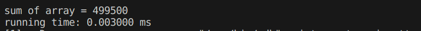

# <center> HPC Lab2-Pthread

## 1. 实验目的
- 掌握 Pthread 编写并行程序

## 2. 实验过程和核心代码
- 安装 `ptheard` 库（环境：Ubuntu 22.04）
    ```shell
    sudo apt-get install libpthread-stubs0-dev
    ```
### 1. 通过 Pthread 实现通用矩阵乘法
1. 问题描述：通过 Pthread 实现通用矩阵乘法的并行版本，并行线程从1增加到8,矩阵规模从512增加到2048
    $$
    \begin{align}
        C &= AB \\
        C_{m, n} &= \sum_{n = 1}^NA_{m, n}B_{n, k}
    \end{align}
    $$
2. 实验过程
   1. 定义矩阵大小和线程数量
    ```cpp
    #define SIZE 2048
    #define NUM_THREADS 8
    ```
   2. 定义全局变量矩阵A， B， C；为了方便起见，统一设置为方阵
    ```cpp
    int A[SIZE][SIZE];
    int B[SIZE][SIZE];
    int C[SIZE][SIZE];
    ```
   3. 定义线程需要运算的每一部分的子矩阵信息，整体思路是将A按行分块为一个个小的矩阵，然后每个线程进行一部分A矩阵和整个B矩阵进行矩阵乘法，存储到C中；因此我们只需要存储每个线程对应的起始行和终止行
    ``` cpp
    // struct of each part of matrix data including start row and end row
    struct thread_data {
        int thread_id;
        int start_row;
        int end_row;
    };
    ```
   4. 定义矩阵乘法，算法逻辑就是通用矩阵乘法，只不过A矩阵的部分根据传入的线程携带的信息决定
    ```cpp
    void* matrix_multiply(void *threadarg) {
        struct thread_data *my_data;
        my_data = (struct thread_data *) threadarg;
        int start_row = my_data->start_row;
        int end_row = my_data->end_row;
        
        for (int i = start_row; i < end_row; i++) {
            for (int j = 0; j < SIZE; j++) {
                C[i][j] = 0;
                for (int k = 0; k < SIZE; k++) {
                    C[i][j] += A[i][k] * B[k][j];
                }
            }
        }
        pthread_exit(NULL);
    }
    ```
   5. main函数中，首先定义一组线程，为每个线程分配相关的信息；注意如果矩阵的大小与线程数量不能整除时，最后一个线程的 `end_row` 需要处理为一直到矩阵A的最后一行 `SIZE`；之后利用 `pthread_create` 创建线程，线程执行完以后用 `pthread_join` 回收对应线程；
    ```cpp
    struct timeval begin_time, end_time; 
    // create NUM_THREADS of threads
    pthread_t threads[NUM_THREADS];
    struct thread_data thread_data_array[NUM_THREADS];
    int rows_per_thread = SIZE / NUM_THREADS;
    
    // begin the matrix multiply
    gettimeofday(&begin_time, NULL);
    
    // create threads, we divide matrix A into 'rows_per_thread'
    for (int i = 0; i < NUM_THREADS; i++) {
        thread_data_array[i].thread_id = i;
        thread_data_array[i].start_row = i * rows_per_thread;
        // deal with the situation where SIZE % NUM_THREADS != 0
        if (i == NUM_THREADS - 1) {
            thread_data_array[i].end_row = SIZE;
        }
        else {
            thread_data_array[i].end_row = (i + 1) * rows_per_thread;
        }
        // create thread to calculate the part of the matrix multiplication
        pthread_create(&threads[i], NULL, matrix_multiply, (void *)&thread_data_array[i]);
    }
    
    // join all threads
    for (int i = 0; i < NUM_THREADS; i++) {
        pthread_join(threads[i], NULL);
    }
    
    gettimeofday(&end_time, NULL); 
    
    // 打印运算时间
    long seconds = end_time.tv_sec - begin_time.tv_sec;
    long microseconds = end_time.tv_usec - begin_time.tv_usec;
    double elapsed_time = seconds + microseconds / 1e6;
    printf("%lf ms elapsed\n", elapsed_time * 1000); 
    ```

3. 验证程序准确性：
   1. 用较小的矩阵进行测试，可以看到运行结果正确
   2. 利用htop查看程序是否利用了对应数目的核心，可以看到当我们指定线程数为8的时候，8个核心确实都在工作

### 2. 基于 Pthread 的数组求和
1. 问题描述
   1. 编写使用多个进程/线程对数组 `a[1000]` 求和的简单程序演示Pthreads的用法。创建n个线程，每个线程通过共享单元`global_index` 获取 `a` 数组的下一个未加元素，注意不能在临界段外访问全局下标 `global_index`
   2. 重写上面的例子，使得各进程可以一次最多提取10个连续的数，以组为单位进行求和，从而减少对下标的访问
2. 实验过程
   1. 定义数组大小和线程数量，全局下标，全局和
    ```c
    #define SIZE 1000
    #define NUM_THREADS 8

    int a[SIZE]; 
    int global_index = 0; 
    int global_sum = 0;
    ```
   2. 定义互斥锁：由于所有线程都会访问下标 `global_index`，因此，需要保证两个线程不可以同时访问，否则会重复计算
    ```c
    pthread_mutex_t mutex = PTHREAD_MUTEX_INITIALIZER; 
    ```
   3. 定义每个线程的详细作用，每个线程会不断访问全局下标 `global_index`，之后将读取到的数字加入到自己的局部和 `local_sum`，最后直到数组下标会越界时，跳出循环，将局部和加入到全局和中
    ```c
    void* sum(void* threadarg) {
        int local_sum = 0; 
        int local_index; 

        while (1) {
            // need to lock to prevent visit global variable at the same time
            pthread_mutex_lock(&mutex); 
            // if index out of array bound, then quit
            if (global_index >= SIZE) {
                pthread_mutex_unlock(&mutex); 
                break; 
            }
            local_index = global_index; 
            global_index++; 
            pthread_mutex_unlock(&mutex); 

            local_sum += a[local_index];
        }

        pthread_mutex_lock(&mutex); 
        global_sum += local_sum; 
        pthread_mutex_unlock(&mutex); 

        pthread_exit(NULL); 
    }
    ```
   4. 在 `main` 函数中，创建线程，收回线程，与第一个问题类似；为了方便检验结果的正确性，我们初始化数组数据为其下标值 `a[i] = i`
    ```c
    struct timeval begin_time, end_time; 
    pthread_t threads[NUM_THREADS]; 

    // Initialize array
    for (int i = 0; i < SIZE; i++) a[i] = i; 

    gettimeofday(&begin_time, NULL);
    // create threads
    for (int i = 0; i < NUM_THREADS; i++) {
        pthread_create(&threads[i], NULL, sum, NULL); 
    }

    // join threads
    for (int i = 0; i < NUM_THREADS; i++) {
        pthread_join(threads[i], NULL); 
    }
    gettimeofday(&end_time, NULL);

    printf("sum of array = %d\n", global_sum); 

    long seconds = end_time.tv_sec - begin_time.tv_sec;
    long microseconds = end_time.tv_usec - begin_time.tv_usec;
    double elapsed_time = seconds + microseconds / 1e6;
    printf("%lf ms elapsed\n", elapsed_time * 1000); 
    ```
3. 验证程序准确性
   1. 首先我们编写了普通的求和程序 `q2_0.c` 得到准确结果：499500
        ```c
        // initialize
        for (int i = 0; i < SIZE; i++) {
            a[i] = i; 
        }
        // sum
        for (int i = 0; i < SIZE; i++) {
            global_sum += a[i];
        }
        ```
        
   2. 之后我们分别运行 `q2_1.c` 和 `q2_2.c`
      1. `q2_1.c`: 可以看到计算结果正确 
        
      2. `q2_2.c`: 可以看到计算结果正确 
         
### 3. 基于 Pthread 求解二次方程组的根
1. 问题描述：编写一个多线程程序来求解二次方程组 $ax^2 + bx + c = 0$ 的根，使用下面的公式
    $$
    x = \frac{-b \pm \sqrt{b^2 - 4ac}}{2a}
    $$
    中间值被不同的线程计算，使用条件变量来识别何时所有的线程都完成了计算
2. 实验过程
   1. 定义互斥锁和条件变量：使用互斥锁的原因是防止同时访问条件变量导致出错；定义全局变量 `threads_completed` 记录线程完成数目
    ```c
    pthread_mutex_t mutex = PTHREAD_MUTEX_INITIALIZER;
    pthread_cond_t cond_var = PTHREAD_COND_INITIALIZER;
    int threads_completed = 0;
    int a, b, c; 
    ```
   2. 将结果的计算分为三个线程，分别计算 $b^2$, $4ac$ 和 $2a$；每次执行完 `signal` 条件变量一次
    ```c
    void* calculate_b2(void* threadarg) {
        int* data = (int*)threadarg;
        *data = b * b;
        pthread_mutex_lock(&mutex);
        threads_completed++;
        pthread_cond_signal(&cond_var);
        pthread_mutex_unlock(&mutex);
        pthread_exit(NULL);
    }

    void* calculate_4ac(void* threadarg) {
        int* data = (int*)threadarg;
        *data = 4 * a * c;
        pthread_mutex_lock(&mutex);
        threads_completed++;
        pthread_cond_signal(&cond_var);
        pthread_mutex_unlock(&mutex);
        pthread_exit(NULL);
    }

    void* calculate_2a(void* threadarg) {
        int* data = (int*)threadarg;
        *data = 2 * a;
        pthread_mutex_lock(&mutex);
        threads_completed++;
        pthread_cond_signal(&cond_var);
        pthread_mutex_unlock(&mutex);
        pthread_exit(NULL);
    }
    ```
   3. 在 `main` 函数中，分别创建线程组和线程所计算的结果的存储数组；`cond_var`的条件变量和`threads_completed`的变量来跟踪已完成的线程数。在每个线程的函数末尾，对`threads_completed`的递增操作，并通过调用`pthread_cond_signal`来发出条件变量的信号。在 `main` 函数中，使用 `pthread_cond_wait` 在循环中等待条件变量的信号，直到所有线程都完成计算；打印结果
    ```c
    pthread_t threads[NUM_THREADS];
    int thread_datas[NUM_THREADS];

    // create threads
    pthread_create(&threads[0], NULL, calculate_b2, (void*)&thread_datas[0]);
    pthread_create(&threads[1], NULL, calculate_4ac, (void*)&thread_datas[1]);
    pthread_create(&threads[2], NULL, calculate_2a, (void*)&thread_datas[2]);

    // wait for all threads to complete
    pthread_mutex_lock(&mutex);
    while (threads_completed < NUM_THREADS) {
        pthread_cond_wait(&cond_var, &mutex);
    }
    pthread_mutex_unlock(&mutex);

    for (int i = 0; i < NUM_THREADS; i++) {
        pthread_join(threads[i], NULL);
    }

    double x1 = (-b + sqrt((double)(thread_datas[0] - thread_datas[1]))) / thread_datas[2];
    double x2 = (-b - sqrt((double)(thread_datas[0] - thread_datas[1]))) / thread_datas[2];

    printf("result of functions: x1 = %.2f; x2 = %.2f\n", x1, x2);
    ```

### 4. 编写一个多线程程序来实现基于monte-carlo​方法的 $y = x^2$ ​阴影面积估算
1. 问题描述：参考课本137页4.2题和本次实验作业的补充材料。 估算 $y=x^2$ 曲线与 $x$ 轴之间区域的面积，其中 $x$ 的范围为 $[0,1]$
2. 实验过程
   1. monte-carlo算法介绍：在总区域内生成一定数量的随机点，并计算落在指定区域的点的数量。最后，计算估算的面积$S_a$为落在指定区域的点数$N_a$除以总区域点数$N$，再乘上总区域面积$S$
    $$
    S_a = \frac{N_a}{N}\times S
    $$
   2. 定义一个互斥锁，防止同时访问 `total_points_under_curve` 和 `total_points` 变量
    ```c
    pthread_mutex_t mutex = PTHREAD_MUTEX_INITIALIZER;

    int total_points_under_curve = 0; // 曲线下方的点的数量
    int total_points = 0; // 总采样点数量
    ```
   3. 每个线程会生成`points_per_thread`ge的随机点，并计算落在曲线下方的点的数量。然后，通过互斥锁来更新全局变量 `total_points_under_curve` 和 `total_points`；其中由于选择区域为 $[0, 1]$ 的正方形区域，因此随机数除以 `RAND_MAX` 恰好可以放缩到 $[0, 1]$ 区间上
    ```c
    void *generate_points(void *arg) {
        int points_per_thread = NUM_POINTS / NUM_THREADS;
        int points_under_curve = 0;
        
        for (int i = 0; i < points_per_thread; i++) {
            double x = (double) rand() / RAND_MAX;
            double y = (double) rand() / RAND_MAX;
            
            if (y <= x * x) {
                points_under_curve++;
            }
        }
        
        pthread_mutex_lock(&mutex);
        total_points_under_curve += points_under_curve;
        total_points += points_per_thread;
        pthread_mutex_unlock(&mutex);
        
        pthread_exit(NULL);
    }
    ```
   4. `main` 函数与前面几问类似，创建线程和回收线程
    ```c
    pthread_t threads[NUM_THREADS];
    srand(time(0));
    
    // create thread
    for (long i = 0; i < NUM_THREADS; i++) {
        pthread_create(&threads[i], NULL, generate_points, (void *)&i);
    }
    
    // join thread
    for (int i = 0; i < NUM_THREADS; i++) {
        pthread_join(threads[i], NULL);
    }
    
    // result area
    double area = (double)total_points_under_curve / total_points;
    printf("Estimated area: %f\n", area);
    ```

## 3. 实验结果
### 1. 通过 Pthread 实现通用矩阵乘法
```shell
gcc -o q1 q1.c -lpthread
```
- 单位：ms
    | matrix size \ `thread` |    1    |    2    |    3    |    4    |    5    |    6    |    7    |    8    |
    | :--------------------: | :-----: | :-----: | :-----: | :-----: | :-----: | :-----: | :-----: | :-----: |
    |          512           |  445.1  |  239.9  |  211.7  |  149.0  |  143.9  |  121.9  |  120.8  |  148.4  |
    |          1024          | 4706.7  | 2614.3  | 1970.3  | 1582.2  | 1295.1  | 1295.6  | 1153.4  | 1110.4  |
    |          2048          | 62599.8 | 31105.9 | 22407.5 | 18967.1 | 16732.3 | 15378.2 | 14208.6 | 14122.7 |
- 分析：可以看到当矩阵规模越大的时候，随着并行规模的增加，运算速度提升显著，运算时间下降
<!-- - ? [todo] -->
### 2. 基于 Pthread 的数组求和
```shell
gcc -o q2_0 q2_0.c -lpthread
gcc -o q2_1 q2_1.c -lpthread
gcc -o q2_2 q2_2.c -lpthread
```
- 数组求和结果：499500
- 运行时间
  - 普通求和：0.00300 ms
  - 每次提取1 个元素的并行求和：1.09300 ms
  - 每次提取10个元素的并行求和：1.04100 ms
### 3. 基于 Pthread 求解二次方程组的根
```shell
gcc -o q3 q3.c -lm -lpthread
```
其中 `-lm` 表示链接到 `<math.h>` 库
- 结果：设置方程为 $x^2 - 3x + 2 = 0, x_1 = 2, x_2 = 1$，可以看到结果正确 
### 4. 编写一个多线程程序
```shell
gcc -o q4 q4.c -lpthread
```
- 问题准确结果为
    $$
    S = \int_{0}^{1}x^2dx = \frac{1}{3}
    $$
- 我们不断增大总采样点数，可以看到结果越来越精确  

