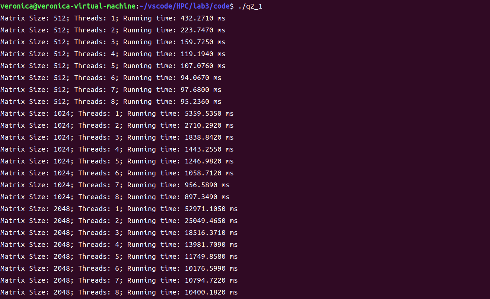

# <center> HPC Lab3-OpenMP

## 1. 实验目的
- 掌握 openmp 编写并行程序

## 2. 实验过程和核心代码
- 安装 OpenMP（环境：Ubuntu 22.04）
    ```shell
    sudo apt install libomp-dev
    ```
### 1. 通过OpenMP实现通用矩阵乘法
1. 问题描述：通过 OpenMP 实现通用矩阵乘法的并行版本，并行线程从1增加到8,矩阵规模从512增加到2048
    $$
    \begin{align}
        C &= AB \\
        C_{m, n} &= \sum_{n = 1}^NA_{m, n}B_{n, k}
    \end{align}
    $$
2. 实验过程
   1. 导入必要的库，定义相关参数
    ```c
    #include <stdio.h>
    #include <sys/time.h>
    #include <omp.h>

    #define NUM_THREADS 8
    #define SIZE 2048

    int A[SIZE][SIZE];
    int B[SIZE][SIZE];
    int C[SIZE][SIZE];
    ```
   2. 定义 openmp 矩阵乘法函数，并返回计算执行时间
    ```c
    double matrix_multiply(int size, int num_threads) {
        struct timeval begin_time, end_time; 
        gettimeofday(&begin_time, NULL); 

        #pragma omp parallel num_threads(num_threads) 
        {
            #pragma omp for 
            for (int i = 0; i < size; i++) {
                for (int j = 0; j < size; j++) {
                    C[i][j] = 0;
                    for (int k = 0; k < size; k++) {
                        C[i][j] += A[i][k] * B[k][j];
                    }
                }
            }
        }

        gettimeofday(&end_time, NULL);
        long seconds = end_time.tv_sec - begin_time.tv_sec;
        long microseconds = end_time.tv_usec - begin_time.tv_usec;
        double elapsed_time = seconds + microseconds / 1e6;
        return elapsed_time * 1000; 
    }
    ```
   3. 在主函数中，初始化矩阵 A 和 B，之后循环测试不同线程数目和不同矩阵规模下的计算时间
    ```c
    int main() {
        // initialize matrix A & B
        for (int i = 0; i < SIZE; i++) {
            for (int j = 0; j < SIZE; j++) {
                A[i][j] = B[i][j] = i + j;
            }
        }

        for (int i = 512; i <= SIZE; i <<= 1) {
            for (int j = 1; j <= NUM_THREADS; j++) {
                double running_time = matrix_multiply(i, j); 
                printf("Matrix Size: %d; Threads: %d; Running time: %.4f ms\n", 
                       i, j, running_time); 
            }
        }
        return 0;
    }
    ```
3. 验证实验
    ```shell
    gcc -fopenmp -o q1 q1.c
    ./q1
    ```
    

### 2. 基于OpenMP的通用矩阵乘法优化
1. 问题描述：分别采用 OpenMP 的默认任务调度机制，静态调度 `schedule(static, 1)`和动态调度 `schedule(dynamic, 1)` 的性能，实现 `#pragma omp for`，比较其性能
2. 实验过程
   1. 默认任务调度机制: 即第一题的代码
   2. 静态调度：将第一题的openmp主体添加 `schedule(static, 1)`
    ```c
    #pragma omp parallel num_threads(num_threads) 
    {
        #pragma omp for schedule(static, 1) // here
        for (int i = 0; i < size; i++) {
            for (int j = 0; j < size; j++) {
                C[i][j] = 0;
                for (int k = 0; k < size; k++) {
                    C[i][j] += A[i][k] * B[k][j];
                }
            }
        }
    }
    ```
   3. 动态调度：将第一题的openmp主体添加 `schedule(dynamic, 1)`
    ```c
    #pragma omp parallel num_threads(num_threads) 
    {
        #pragma omp for schedule(dynamic, 1) // here
        for (int i = 0; i < size; i++) {
            for (int j = 0; j < size; j++) {
                C[i][j] = 0;
                for (int k = 0; k < size; k++) {
                    C[i][j] += A[i][k] * B[k][j];
                }
            }
        }
    }
    ```
3. 验证实验
   1. 默认调度 
    ```shell
    gcc -fopenmp -o q1 q1.c
    ./q1
    ```
    
   2. 静态调度
    ```shell
    gcc -fopenmp -o q2_1 q2_1.c
    ./q2_1
    ``` 
    
   3. 动态调度 
    ```shell
    gcc -fopenmp -o q2_2 q2_2.c
    ./q2_2
    ``` 
    

### 3. 构造基于Pthreads的并行for循环分解、分配和执行机制
1. 问题描述
   1. 基于 `pthreads` 的多线程库提供的基本函数，如线程创建、线程`join`、线程同步等。构建`parallel_for`函数对循环分解、分配和执行机制，函数参数包括但不限于`(int start, int end, int increment, void *(*functor)(void*), void *arg , int num_threads)`；其中`start`为循环开始索引；`end`为结束索引；`increment`每次循环增加索引数；`functor`为函数指针，指向的需要被并行执行循环程序块；`arg`为`functor`的入口参数；`num_threads`为并行线程数
   2. 在Linux系统中将`parallel_for`函数编译为`.so`文件，由其他程序调用
   3. 将通用矩阵乘法的`for`循环，改造成基于`parallel_for`函数并行化的矩阵乘法，注意只改造可被并行执行的`for`循环（例如无race condition、无数据依赖、无循环依赖等）
2. 实验过程
   1. 编写头文件 `myfor.h`，定义 `parallel_for` 函数以及传递时需要用到的结构体
    ```c
    #ifndef MYFOR_H
    #define MYFOR_H
    #include <pthread.h>

    typedef struct {
        int start; 
        int end; 
        int increment; 
        void* (*functor)(void* ); 
        void* arg; 
    } ParallelType; 

    void* parallel_for(
        int start, 
        int end, 
        int increment, 
        void* (*functor)(void* ), 
        void* arg, 
        int num_threads); 
    #endif
    ```
   2. 实现 `parallel_for` 函数，基本思想与 实验2 pthread 类似，为每一部分 for 循环的部分分配一个线程，之后回收所有线程返回；注意 [start, end) 为左闭右开
    ```c
    void* parallel_for(int start, int end, int increment, void* (*functor)(void* ), void* arg, 
                       int num_threads) {
        pthread_t threads[num_threads]; 
        ParallelType cells[num_threads]; 
        int size_per_thread = (end - start) / num_threads; 
        for (int i = 0; i < num_threads; i++) {
            cells[i].start = start + i * size_per_thread; 
            cells[i].end = i == (num_threads - 1) ? end : (start + (i + 1) * size_per_thread); 
            cells[i].increment = increment; 
            cells[i].functor = functor; 
            cells[i].arg = arg;
            
            pthread_create(&threads[i], NULL, functor, (void*)&cells[i]); 
        }

        for (int i = 0; i < num_threads; i++) {
            pthread_join(threads[i], NULL); 
        }

        return NULL; 
    }
    ```
   3. 编译文件为 `.o` 文件，之后将`parallel_for`函数编译为`.so`文件，由其他程序调用
    ```shell
    gcc -c -fPIC -o myfor.o myfor.c 
    gcc -shared -o libmyfor.so myfor.o
    ```
   4. 编写测试函数，调用 "myfor.h" 的`parallel_for`函数，之后进行矩阵并行乘法
    ```c
    #include "myfor.h"
    ...

    void* matrix_multiply(void* args) {
        ParallelType* p = (ParallelType*)args; 
        int start = p->start; 
        int end = p->end; 
        int increment = p->increment;

        for (int i = start; i < end; i+= increment) {
            for (int j = 0; j < SIZE; j++) {
                C[i][j] = 0; 
                for (int k = 0; k < SIZE; k++) {
                    C[i][j] += A[i][k] * B[j][k];
                }
            }
        }

        return NULL; 
    }

    int main() {
        // initialize matrix A & B
        for (int i = 0; i < SIZE; i++) {
            for (int j = 0; j < SIZE; j++) {
                A[i][j] = B[i][j] = i + j;
            }
        }

        ParallelType args; 

        parallel_for(0, SIZE, 1, matrix_multiply, NULL, NUM_THREADS); 
    }
    ```

## 3. 实验结果
### 1. 通过OpenMP实现通用矩阵乘法
单位：ms

| Matrix Size/Threads | 1        | 2        | 3        | 4        | 5        | 6       | 7       | 8       |
| ------------------- | -------- | -------- | -------- | -------- | -------- | ------- | ------- | ------- |
| 512                 | 436.27   | 223.72   | 157.34   | 118.87   | 101.47   | 87.97   | 86.65   | 93.48   |
| 1024                | 5314.85  | 2687.31  | 1824.58  | 1404.21  | 1173.49  | 1040.76 | 924.48  | 888.63  |
| 2048                | 47357.26 | 24279.94 | 16586.41 | 12977.71 | 10779.60 | 9708.70 | 8682.82 | 7971.73 |


### 2. 基于OpenMP的通用矩阵乘法优化
1. 默认调度：单位：ms

| Matrix Size/Threads | 1        | 2        | 3        | 4        | 5        | 6        | 7        | 8        |
| ------------------- | -------- | -------- | -------- | -------- | -------- | -------- | -------- | -------- |
| 512                 | 433.82   | 232.12   | 159.06   | 128.40   | 98.00    | 97.45    | 88.69    | 89.02    |
| 1024                | 5202.15  | 2659.74  | 1837.62  | 1626.56  | 1217.23  | 1077.12  | 979.93   | 917.97   |
| 2048                | 51052.33 | 29893.75 | 17605.85 | 13601.12 | 11825.53 | 14971.73 | 13930.29 | 13989.29 |


2. 静态调度：单位：ms

| Matrix Size/Threads | 1        | 2        | 3        | 4        | 5        | 6        | 7        | 8        |
| ------------------- | -------- | -------- | -------- | -------- | -------- | -------- | -------- | -------- |
| 512                 | 432.27   | 223.75   | 159.73   | 119.19   | 107.08   | 94.07    | 97.68    | 95.24    |
| 1024                | 5359.54  | 2710.29  | 1838.84  | 1443.26  | 1247.00  | 1058.71  | 956.59   | 897.35   |
| 2048                | 52971.11 | 25049.47 | 18516.37 | 13981.71 | 11749.86 | 10176.60 | 10794.72 | 10400.18 |

3. 动态调度：单位：ms

| Matrix Size/Threads | 1        | 2        | 3        | 4        | 5        | 6        | 7        | 8        |
| ------------------- | -------- | -------- | -------- | -------- | -------- | -------- | -------- | -------- |
| 512                 | 441.82   | 233.59   | 161.07   | 128.73   | 105.19   | 94.61    | 83.52    | 97.90    |
| 1024                | 5473.45  | 2990.10  | 1932.65  | 1488.17  | 1282.08  | 1234.50  | 1429.10  | 1579.42  |
| 2048                | 52384.29 | 26170.78 | 18146.90 | 13902.29 | 12364.17 | 11292.37 | 11233.89 | 11554.16 |

4. 可视化
   1. matrix size: 512 
   2. matrix size: 1024 
   3. matrix size: 2048 
5. 比较性能：通过可视化结果我们可以看到三种调度方式基本上性能大致相同，基本性能相当


### 3. 构造基于Pthreads的并行for循环分解、分配和执行机制
1. 验证 `.so` 文件链接成功可以看到 `libmyfor.so`文件生成成功，之后编译测试文件
    ```shell
    gcc q3.c -o q3 -I. -L. -Wl,-rpath=. -lmyfor
    ```
    之后查看是否链接
    ```shell
    ldd q3
    ```
    可以看到链接成功
2. 测试：使用矩阵规模为4,线程为2,可以看到计算结果正确
    ``` shell
    ./q3
    ```
    
