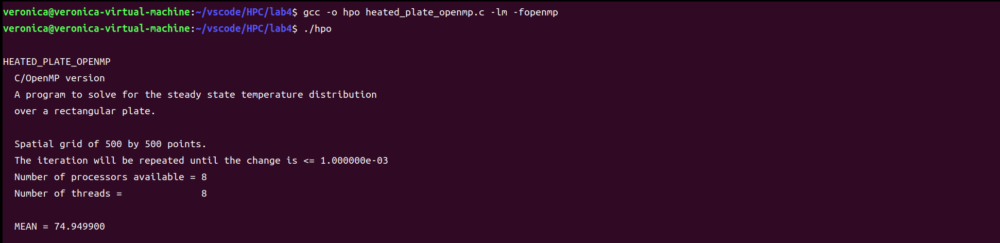
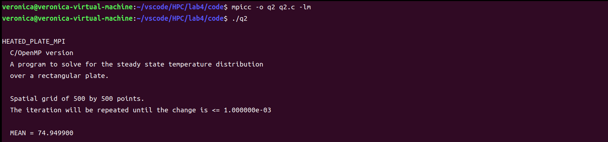
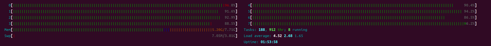
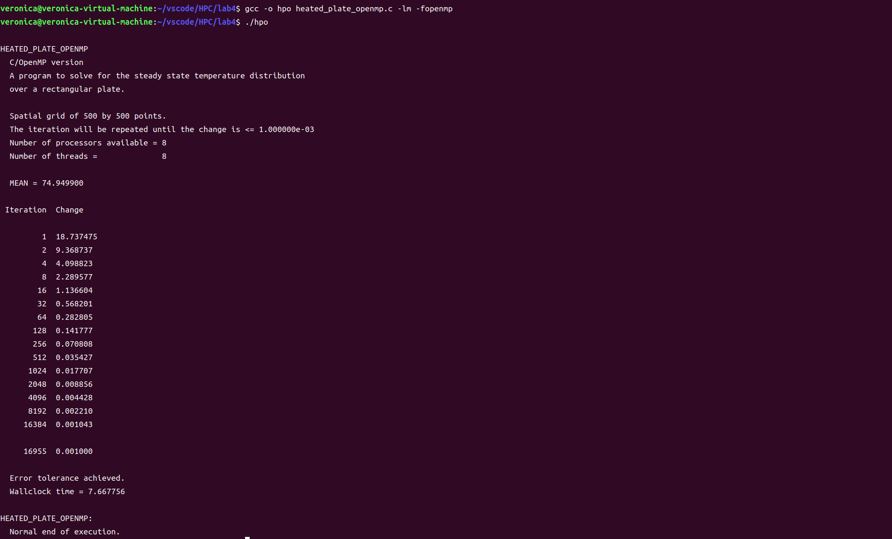
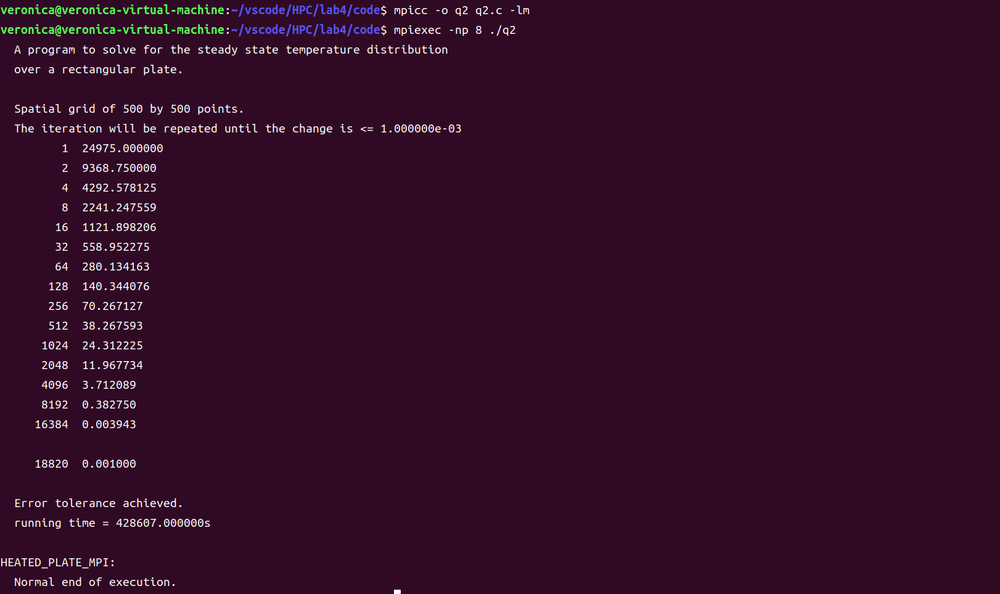
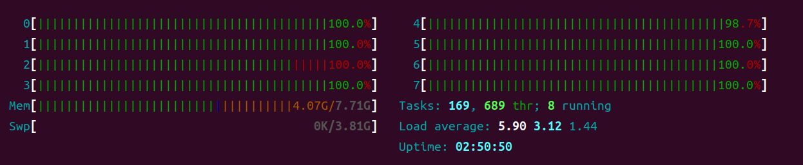
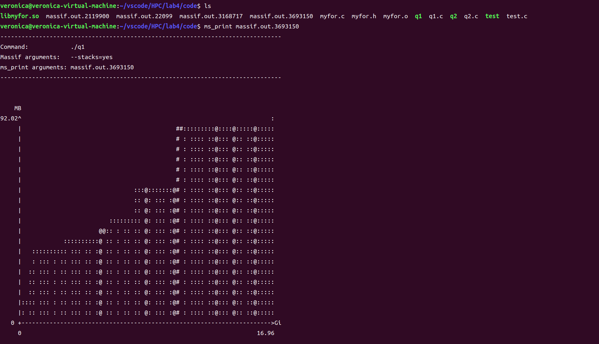
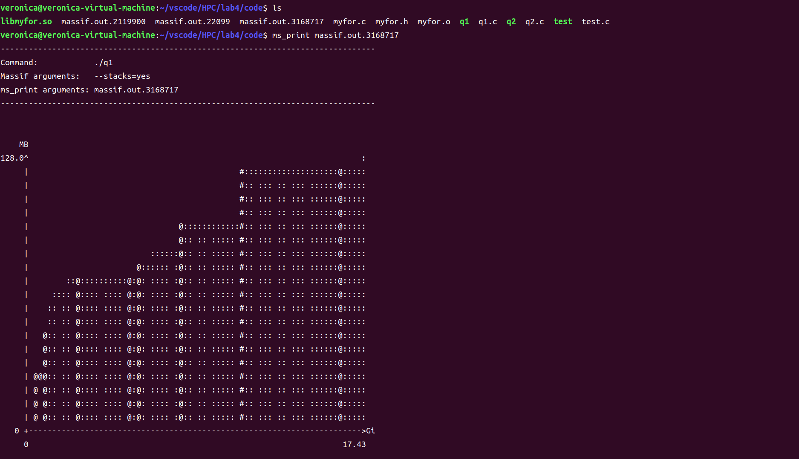
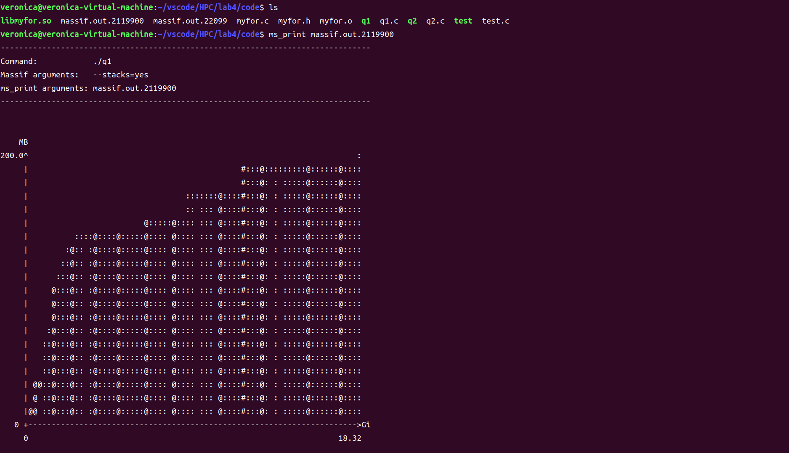
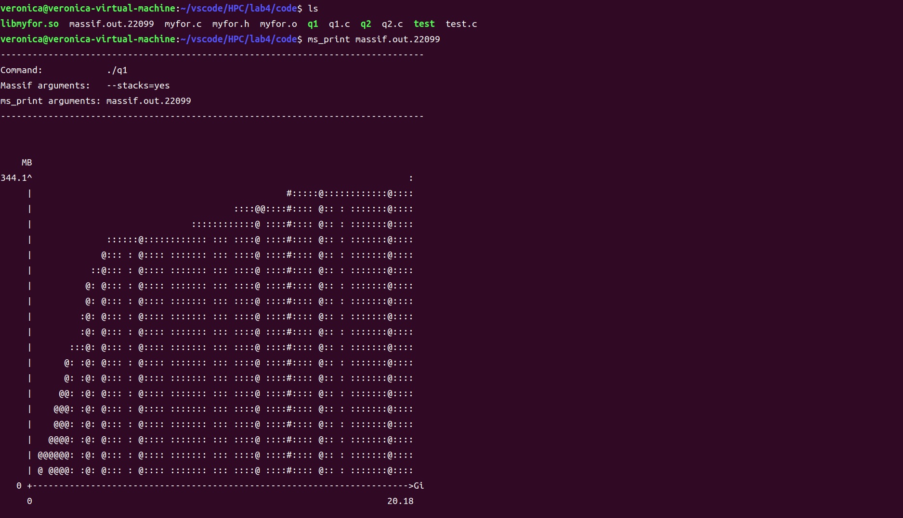

# <center> HPC Lab4-Parallel Training

## 1. 实验目的
- 分析并改造 `fft` 并行化算法

## 2. 实验过程和核心代码
### 1. 通过 `parallel_for` 改造 `fft_serial`
1. 问题描述：通过实验3构造的基于 `Pthreads` 的 `parallel_for` 函数替换 `fft_serial` 应用中的某些计算量较大的 `for` 循环，实现 `for` 循环分解、分配和线程并行执行
2. 实验过程 
   1. 改造初始化代码( `fft_serial.c` 的134-142行代码)
      ```c
      // original
      for ( i = 0; i < 2 * n; i = i + 2 ) {
         z0 = 0.0;              /* real part of array */
         z1 = 0.0;              /* imaginary part of array */
         x[i] = z0;
         z[i] = z0;             /* copy of initial real data */
         x[i+1] = z1;
         z[i+1] = z1;           /* copy of initial imag. data */
      }
      ```
      设置 `parallel_for` 的参数从 0 循环到 2n，每次增长2,循环具体内容由 `initialize_parallel` 定义 
      ```c
      void* initialize_parallel(void* args) {
         ParallelType* p = (ParallelType*)args;
         int start = p->start;
         int end = p->end;
         int increment = p->increment;
         for (int index = start; index < end; index += increment) {
            x[index] = 0.0;
            z[index] = 0.0;           /* copy of initial real data */
            x[index + 1] = 0.0;
            z[index + 1] = 0.0;         /* copy of initial imag. data */
         }
         return NULL; 
      }
      ...
      // [0:2 * n], parallel function: initialize_parallel
      parallel_for(0, 2 * n, 2, initialize_parallel, NULL, NUM_THREADS);
      ```
   2. 改造 `ccfti` 函数（`fft_serial.c` 的387-402行代码）
      ```c
      // original
      void cffti ( int n, double w[] ) {
         double arg;
         double aw;
         int i;
         int n2;
         const double pi = 3.141592653589793;

         n2 = n / 2;
         aw = 2.0 * pi / ( ( double ) n );

         for ( i = 0; i < n2; i++ ) {
            arg = aw * ( ( double ) i );
            w[i * 2 + 0] = cos ( arg );
            w[i * 2 + 1] = sin ( arg );
         }
         return;
      }
      ```
      设置 `parallel_for` 的参数从 0 循环到 n2，每次增长1,循环具体内容由 `cffti_parallel` 定义 
      ```c
      void* cffti_parallel(void* args) {
         ParallelType *p = (ParallelType*)args;
         double aw = 2.0 * pi / ((double)n); 
         int start = p->start;
         int end = p->end;
         int increment = p->increment;
         for (int index = start; index < end; index += increment) {
            double arg = aw * ((double)index);
            w[index * 2 + 0] = cos(arg);
            w[index * 2 + 1] = sin(arg);
         }
         return NULL; 
      }
      ...
      void cffti ( int n, double w[] ) {
         double aw;
         int n2;
         const double pi = 3.141592653589793;

         n2 = n / 2;
         aw = 2.0 * pi / ( ( double ) n );
         
         // [0:n2], parallel function: cffti_parallel
         parallel_for(0, n2, 1, cffti_parallel, NULL, NUM_THREADS); 
         return;
      }
      ```
   3. 改造 `step` 函数（`fft_serial.c` 的525-553行代码）
      ```c
      // original
      void step ( int n, int mj, double a[], double b[], double c[], double d[], double w[], 
      double sgn ) {
         double ambr;
         double ambu;
         int j;
         int ja;
         int jb;
         int jc;
         int jd;
         int jw;
         int k;
         int lj;
         int mj2;
         double wjw[2];

         mj2 = 2 * mj;
         lj  = n / mj2;

         for ( j = 0; j < lj; j++ ) {
            jw = j * mj;
            ja  = jw;
            jb  = ja;
            jc  = j * mj2;
            jd  = jc;

            wjw[0] = w[jw*2+0]; 
            wjw[1] = w[jw*2+1];

            if ( sgn < 0.0 ) {
               wjw[1] = - wjw[1];
            }

            for ( k = 0; k < mj; k++ ) {
               c[(jc+k)*2+0] = a[(ja+k)*2+0] + b[(jb+k)*2+0];
               c[(jc+k)*2+1] = a[(ja+k)*2+1] + b[(jb+k)*2+1];

               ambr = a[(ja+k)*2+0] - b[(jb+k)*2+0];
               ambu = a[(ja+k)*2+1] - b[(jb+k)*2+1];

               d[(jd+k)*2+0] = wjw[0] * ambr - wjw[1] * ambu;
               d[(jd+k)*2+1] = wjw[1] * ambr + wjw[0] * ambu;
            }
         }
         return;
      }
      ```
      设置 `parallel_for` 的参数从 0 循环到 lj，每次增长1,循环具体内容由 `step_parallel` 定义；其中由于 `step` 函数变量过多，因此定义了一个全局结构体变量 `temp` 来装载函数参数
      ```c
      typedef struct{
         int mj; 
         double *a; 
         double *b; 
         double *c;
         double *d;
         double *w;
         double sgn; 
      } temp_parallel ; 

      temp_parallel temp; 
      void* step_parallel(void* args) {
         ParallelType *p = (ParallelType*)args;
         int start = p->start;
         int end = p->end;
         int increment = p->increment;
         temp_parallel arg = temp; 
         int mj = arg.mj; 
         double *a = arg.a; 
         double *b = arg.b;  
         double *c = arg.c; 
         double *d = arg.d; 
         double *w = arg.w; 
         double sgn = arg.sgn;

         for (int index = start; index < end; index += increment) {
            int jw = index * mj; 
            int ja = jw; 
            int jb = ja; 
            int jc = index * mj * 2; 
            int jd = jc; 
            double wjw[2] = {w[jw * 2 + 0], w[jw * 2 + 1]}; 
            if (sgn < 0.0) {
               wjw[1] = -wjw[1];
            }
            for (int index2 = 0; index2 < mj; index2++) {
               c[(jc + index2) * 2 + 0] = a[(ja + index2) * 2 + 0] + b[(jb + index2) * 2 + 0]; 
               c[(jc + index2) * 2 + 1] = a[(ja + index2) * 2 + 1] + b[(jb + index2) * 2 + 1]; 
               double ambr = a[(ja + index2) * 2 + 0] - b[(jb + index2) * 2 + 0]; 
               double ambu = a[(ja + index2) * 2 + 1] - b[(jb + index2) * 2 + 1]; 
               d[(jd + index2) * 2 + 0] = wjw[0] * ambr - wjw[1] * ambu; 
               d[(jd + index2) * 2 + 1] = wjw[1] * ambr + wjw[0] * ambu; 
            }
         }
      }

      ...
      void step ( int n, int mj, double a[], double b[], double c[], double d[], double w[], 
      double sgn ) {
         temp.mj = mj; 
         temp.a = a; 
         temp.b = b; 
         temp.c = c; 
         temp.d = d; 
         temp.w = w; 
         temp.sgn = sgn; 

         int mj2 = 2 * mj;
         int lj  = n / mj2;

         // [0:lj], parallel function: step_parallel
         parallel_for(0, lj, 1, step_parallel, NULL, NUM_THREADS); 
      }
      ```

### 2. 将 `heated_plate_openmp` 应用改造成基于MPI的进程并行应用
1. 问题描述：将 `heated_plate_openmp` 应用改造成基于MPI的进程并行应用（为了适合MPI的消息机制，可能需要对 `heated_plate_openmp` 的代码实现做一定调整）
2. 实验过程
   1. 为了方便 MPI 框架，我们将原本二维数组的 `w`, `u` 变为一维数组 
      ```c
      int rank, size, tag = 0;
      MPI_Init(NULL, NULL); 
      MPI_Comm_rank(MPI_COMM_WORLD, &rank); 
      MPI_Comm_size(MPI_COMM_WORLD, &size);
      double* u = (double*)malloc(sizeof(double) * M * N);
      double* w = (double*)malloc(sizeof(double) * M * N);
      ```
   2. 我们将如下初始化代码进行整合
      ```c
      #pragma omp for
         for ( i = 1; i < M - 1; i++ )
         {
            w[i][0] = 100.0;
         }
      #pragma omp for
         for ( i = 1; i < M - 1; i++ )
         {
            w[i][N-1] = 100.0;
         }
      ...
      #pragma omp for reduction ( + : mean )
         for ( i = 1; i < M - 1; i++ )
         {
            mean = mean + w[i][0] + w[i][N-1];
         }
      ```
      在MPI框架下，设置0号进程负责发送消息，然后处理剩余初始化步骤，之后回收其他进程初始化后的结果；为了避免竞争条件，我们使用 `MPI_Reduce` 搭配 `MPI_SUM` 来进行 `mean` 的全局加和，以避免所有进程同时访问全局变量 `mean` 导致竞争冲突，同时也保证了所有进程执行完这一步骤后再同时开始下一步代码工作
      ```c
      int tag = 0; 
      if (rank == 0) {
         ...
         // initialize 1
         int block = M / size; 
         double local_mean = 0.0;
         ++tag; 
         for (int i = 1; i < size; i++) {
            MPI_Send(w + (i - 1) * block * N, N * block, MPI_DOUBLE, i, tag, MPI_COMM_WORLD);
         }
         // figure out the rest part
         for (int i = (size - 1) * block + (size == 1); i < M - 1; i++) {
            w[i * N + 0] = w[i * N + N - 1] = 100.0; 
            local_mean += w[i * N + 0] + w[i * N + N - 1]; 
         }
         ++tag; 
         for (int i = 1; i < size; i++) {
            MPI_Recv(w + (i - 1) * block * N, N * block, MPI_DOUBLE, i, tag, 
            MPI_COMM_WORLD, MPI_STATUS_IGNORE); 
         }
         MPI_Reduce(&local_mean, &mean, 1, MPI_DOUBLE, MPI_SUM, 0, MPI_COMM_WORLD);
         ...
      }
      else {
         ...
         // initialize 1
         int block = M / size; 
         double local_mean = 0.0;
         MPI_Recv(w + (rank - 1) * block * N, N * block, MPI_DOUBLE, 0, ++tag, 
         MPI_COMM_WORLD, MPI_STATUS_IGNORE);
         for (int i = (rank == 1) ? 1 : (rank - 1) * block; i < rank * block; i++) {
            w[i * N + 0] = w[i * N + N - 1] = 100.0;
            local_mean += w[i * N + 0] + w[i * N + N - 1]; 
         }
         double global_mean = 0.0; 
         MPI_Send(w + (rank - 1) * block * N, N * block, MPI_DOUBLE, 0, ++tag, MPI_COMM_WORLD); 
         MPI_Reduce(&local_mean, &global_mean, 1, MPI_DOUBLE, MPI_SUM, 0, MPI_COMM_WORLD);
         ...
      }
      ```
   3. 我们将如下初始化代码进行整合
      ```c
      #pragma omp for
         for ( j = 0; j < N; j++ )
         {
            w[M-1][j] = 100.0;
         }
      #pragma omp for
         for ( j = 0; j < N; j++ )
         {
            w[0][j] = 0.0;
         }
      ...
      #pragma omp for reduction ( + : mean )
         for ( j = 0; j < N; j++ )
         {
            mean = mean + w[M-1][j] + w[0][j];
         }
      ```
      在MPI框架下，设置0号进程负责发送消息，然后处理剩余初始化步骤，之后回收其他进程初始化后的结果；为了避免竞争条件，我们使用 `MPI_Reduce` 搭配 `MPI_SUM` 来进行 `mean` 的全局加和，以避免所有进程同时访问全局变量 `mean` 导致竞争冲突，同时也保证了所有进程执行完这一步骤后再同时开始下一步代码工作
      ```c
      if (rank == 0) {
         ...
         // initialize 2
         block = N / size; 
         local_mean = 0.0; 

         ++tag; 
         for (int i = 1; i < size; i++) {
            MPI_Send(w + (i - 1) * block, block, MPI_DOUBLE, i, tag, 
            MPI_COMM_WORLD);
         }
         // figure out the rest part
         for (int i = (size - 1) * block; i < N; i++) {
            w[i] = 0.0; 
            w[(M - 1) * N + i] = 100.0; 
            local_mean += w[i] + w[(M - 1) * N + i]; 
         }
         ++tag; 
         for (int i = 1; i < size; i++) {
            MPI_Recv(w + (i - 1) * block, block, MPI_DOUBLE, i, tag, 
            MPI_COMM_WORLD, MPI_STATUS_IGNORE); 
         }
         MPI_Reduce(&local_mean, &mean, 1, MPI_DOUBLE, MPI_SUM, 0, 
         MPI_COMM_WORLD);
         ...
      }
      else {
         ...
         // initialize 2
         block = N / size; 
         local_mean = 0.0; 

         MPI_Recv(w + (rank - 1) * block, block, MPI_DOUBLE, 0, ++tag, 
         MPI_COMM_WORLD, MPI_STATUS_IGNORE);
         for (int i = (rank - 1) * block; i < rank * block; i++) {
            w[i] = 0.0; 
            w[(M - 1) * N + i] = 100.0; 
            local_mean += w[i] + w[(M - 1) * N + i]; 
         }
         MPI_Send(w + (rank - 1) * block, block, MPI_DOUBLE, 0, ++tag, 
         MPI_COMM_WORLD);
         MPI_Reduce(&local_mean, &global_mean, 1, MPI_DOUBLE, MPI_SUM, 0, 
         MPI_COMM_WORLD);  
         ...       
      }
      ```
   4. 我们将如下 `w` 的初始化代码
      ```c
      #pragma omp parallel shared ( mean, w ) private ( i, j )
      {
      #pragma omp for
         for ( i = 1; i < M - 1; i++ )
         {
            for ( j = 1; j < N - 1; j++ )
            {
            w[i][j] = mean;
            }
         }
      }
      ```
      变为 MPI 代码，其中类似上面的步骤，0号进程负责发送接收，并处理剩余的初始化步骤；注意，我们使用 `MPI_Barrier` 来保证所有进程都执行完了才进行下一步的操作，以避免错误
      ```c
      if (rank == 0) {
         ...
         // initialize 3
         block = M / size; 

         ++tag; 
         for (int i = 1; i < size; i++) {
            MPI_Send(w + (i - 1) * block * N, N * block, MPI_DOUBLE, i, tag, MPI_COMM_WORLD);
            MPI_Send(&mean, 1, MPI_DOUBLE, i, tag + 1, MPI_COMM_WORLD); 
         }
         tag += 2; 
         // figure out the rest part
         for (int i = (size - 1) * block + (size == 1); i < M - 1; i++) {
            for (int j = 0; j < N - 1; j++) {
                  w[i * N + j] = mean; 
            }
         }
         for (int i = 1; i < size; i++) {
            MPI_Recv(w + (i - 1) * block * N, N * block, MPI_DOUBLE, i, tag, 
            MPI_COMM_WORLD, MPI_STATUS_IGNORE); 
         }
         MPI_Barrier(MPI_COMM_WORLD); 
         ...
      }
      else {
         ...
         // initialize 3
         block = M / size; 
         double mean = 0.0;
         MPI_Recv(w + (rank - 1) * block * N, N * block, MPI_DOUBLE, 0, ++tag, MPI_COMM_WORLD, 
         MPI_STATUS_IGNORE);
         MPI_Recv(&mean, 1, MPI_DOUBLE, 0, ++tag, MPI_COMM_WORLD, MPI_STATUS_IGNORE); 
         for (int i = (rank == 1) ? 1 : (rank - 1) * block; i < rank * block; i++) {
            for (int j = 0; j < N - 1; j++) {
                  w[i * N + j] = mean; 
            }
         }
         MPI_Send(w + (rank - 1) * block * N, N * block, MPI_DOUBLE, 0, ++tag, MPI_COMM_WORLD); 
         MPI_Barrier(MPI_COMM_WORLD);
         ...
      }
      ```
   5. 对于 `while` 循环，整体思路是0号进程负责分配任务和打印相关信息，最后发送是否继续循环的 `isloop` 信息，以实现所有进程同步循环，以下为原代码
      ```c
      iterations = 0;
      iterations_print = 1;
      printf ( "\n" );
      printf ( " Iteration  Change\n" );
      printf ( "\n" );
      wtime = omp_get_wtime ( );

      diff = epsilon;

      while ( epsilon <= diff )
      {
      # pragma omp parallel shared ( u, w ) private ( i, j )
         {
      # pragma omp for
            for ( i = 0; i < M; i++ ) 
            {
            for ( j = 0; j < N; j++ )
            {
               u[i][j] = w[i][j];
            }
            }
      # pragma omp for
            for ( i = 1; i < M - 1; i++ )
            {
            for ( j = 1; j < N - 1; j++ )
            {
               w[i][j] = ( u[i-1][j] + u[i+1][j] + u[i][j-1] + u[i][j+1] ) / 4.0;
            }
            }
         }
         diff = 0.0;
      # pragma omp parallel shared ( diff, u, w ) private ( i, j, my_diff )
         {
            my_diff = 0.0;
      # pragma omp for
            for ( i = 1; i < M - 1; i++ )
            {
            for ( j = 1; j < N - 1; j++ )
            {
               if ( my_diff < fabs ( w[i][j] - u[i][j] ) )
               {
                  my_diff = fabs ( w[i][j] - u[i][j] );
               }
            }
            }
      # pragma omp critical
            {
            if ( diff < my_diff )
            {
               diff = my_diff;
            }
            }
         }
         iterations++;
         if ( iterations == iterations_print )
         {
            printf ( "  %8d  %f\n", iterations, diff );
            iterations_print = 2 * iterations_print;
         }
      } 
      ```
      改造为(注意：为了避免竞争条件，我们对于 `my_diff` 的赋值改为了使用 `MPI_Reduce` 和 `MPI_MAX` 的搭配；另外，每一段工作进行完以后使用 `MPI_Barrier` 来保证所有进程都执行完了才进行下一步的操作，以避免错误)
      ```c
      if (rank == 0) {
         ...
         diff = epsilon; 
         while (epsilon <= diff) {
            // save old
            ++tag; 
            for (int i = 1; i < size; i++) {
               MPI_Send(w + (i - 1) * block * N, N * block, MPI_DOUBLE, i, tag, 
               MPI_COMM_WORLD);
            }
            MPI_Barrier(MPI_COMM_WORLD); 
            // figure out the rest part
            for (int i = (size - 1) * block; i < M; i++) {
               for (int j = 0; j < N; j++) {
                  u[i * N + j] = w[i * N + j]; 
               }
            }
            ++tag; 
            for (int i = 1; i < size; i++) {
               MPI_Recv(u + (i - 1) * block * N, N * block, MPI_DOUBLE, i, tag, 
               MPI_COMM_WORLD, MPI_STATUS_IGNORE);
            }
            MPI_Barrier(MPI_COMM_WORLD); 

            // calculate average w
            ++tag; 
            for (int i = 1; i < size; i++) {
               MPI_Send(w + (i - 1) * block * N, N * block, MPI_DOUBLE, i, tag, 
               MPI_COMM_WORLD);
            }
            // figure out the rest part
            for (int i = (size - 1) * block + (size == 1); i < M - 1; i++) {
               for (int j = 1; j < N - 1; j++) {
                  w[i * N + j] = (u[(i - 1) * N + j] + u[(i + 1) * N + j]
                     + u[i * N + j - 1] + u[i * N + j + 1] ) / 4.0; 
               }
            }
            ++tag; 
            for (int i = 1; i < size; i++) {
               MPI_Recv(w + (i - 1) * block * N, N * block, MPI_DOUBLE, i, tag, 
               MPI_COMM_WORLD, MPI_STATUS_IGNORE);
            }
            MPI_Barrier(MPI_COMM_WORLD); 

            diff = my_diff = 0.0; 
            // find max diff
            double local_max_diff = 0.0; 
            ++tag; 
            for (int i = 1; i < size; i++) {
               MPI_Send(w + (i - 1) * block * N, N * block, MPI_DOUBLE, i, tag, 
               MPI_COMM_WORLD);
            }
            // figure out the rest part
            for (int i = (size - 1) * block + (size == 1); i < M - 1; i++) {
               for (int j = 1; j < N - 1; j++) {
                  if (local_max_diff < fabs(w[i * N + j] - u[i * N + j])) {
                     local_max_diff = fabs(w[i * N + j] - u[i * N + j]); 
                  }
               }
            }
            MPI_Reduce(&local_max_diff, &my_diff, 1, MPI_DOUBLE, MPI_MAX, 0, 
            MPI_COMM_WORLD);

            if (diff < my_diff) diff = my_diff; 

            iterations++; 
            if (iterations == iterations_print) {
               printf("  %8d  %f\n", iterations, diff);
               iterations_print = iterations_print * 2; 
            }

            // send loop message
            int isloop = (epsilon <= diff); 
            ++tag; 
            for (int i = 1; i < size; i++) {
               MPI_Send(&isloop, 1, MPI_INT, i, tag, MPI_COMM_WORLD); 
            }
            MPI_Barrier(MPI_COMM_WORLD); 
         }
        ...
      }
      else {
         ...
         int isloop = 1; 
         while (isloop) {
            // save old
            MPI_Recv(w + (rank - 1) * block * N, N * block, MPI_DOUBLE, 0, ++tag, 
            MPI_COMM_WORLD, MPI_STATUS_IGNORE);
            for (int i = (rank - 1) * block; i < rank * block; i++) {
               for (int j = 0; j < N; j++) {
                  u[i * N + j] = w[i * N + j]; 
               }
            }
            MPI_Barrier(MPI_COMM_WORLD);

            MPI_Send(u + (rank - 1) * block * N, N * block, MPI_DOUBLE, 0, ++tag, 
            MPI_COMM_WORLD);
            MPI_Barrier(MPI_COMM_WORLD);

            // calculate average w
            MPI_Recv(w + (rank - 1) * block * N, N * block, MPI_DOUBLE, 0, ++tag, 
            MPI_COMM_WORLD, 
            MPI_STATUS_IGNORE);
            for (int i = (rank == 1) ? 1 : (rank - 1) * block; i < rank * block; i++) {
               for (int j = 1; j < N - 1; j++) {
                  w[i * N + j] = (u[(i - 1) * N + j] + u[(i + 1) * N + j] + u[i * N + j - 1] + 
                  u[i * N + j + 1] ) / 4.0;
               }
            }
            MPI_Send(w + (rank - 1) * block * N, N * block, MPI_DOUBLE, 0, ++tag, 
            MPI_COMM_WORLD);
            MPI_Barrier(MPI_COMM_WORLD);

            // find max diff
            double local_max_diff = 0.0; 
            MPI_Recv(w + (rank - 1) * block * N, N * block, MPI_DOUBLE, 0, ++tag, 
            MPI_COMM_WORLD, MPI_STATUS_IGNORE);
            for (int i = (rank == 1) ? 1 : (rank - 1) * block; i < rank * block; i++) {
               for (int j = 1; j < N - 1; j++) {
                  if (local_max_diff < fabs(w[i * N + j] - u[i * N + j])) {
                     local_max_diff = fabs(w[i * N + j] - u[i * N + j]); 
                  }
               }
            }
         
            double global_max_diff = 0.0; 
            MPI_Reduce(&local_max_diff, &global_max_diff, 1, MPI_DOUBLE, MPI_MAX, 0, 
            MPI_COMM_WORLD);

            MPI_Recv(&isloop, 1, MPI_INT, 0, ++tag, MPI_COMM_WORLD, 
            MPI_STATUS_IGNORE); 
            MPI_Barrier(MPI_COMM_WORLD);
         }
         ...
      }
      ```
3. 测试代码：由于代码逻辑有些许变动，因此需要测试以保证代码的可运行性和正确性；例如对于 `mean` 的求解，对于原代码 `heated_plate_openmp.c` 对于我们改造后的 `MPI` 代码 可以看到 `mean` 的初始值都是 74.949900，从而保证了代码的可运行性和正确性

### 3. 通过 `vargrind` 进行性能分析
1. 问题描述：对任务1实现的并行化 `fft` 应用在不同规模下的性能进行分析，即分析：
   1. 不同规模下的并行化 `fft` 应用的执行时间对比
   2. 不同规模下的并行化 `fft` 应用的内存消耗对比

> 本题中，“规模”定义为“问题规模”和“并行规模”；“性能”定义为“执行时间”和“内存消耗”。
> 其中，问题规模 `N` ，值为2，4，6，8，16，32，64，128，...， 2097152；并行规模，值为1，2，4，8进程/线程。
> 提示：内存消耗采用 `valgrind massif` 工具采集，注意命令 `valgrind` 命令中增加 `--stacks=yes` 参数采集程序运行栈内内存消耗。Valgrind massif输出日志（massif.out.pid）经过 `ms_print` 打印，其中x轴为程序运行时间，y轴为内存消耗量

2. 实验过程
   1. 设置并行线程数量
      ```c
      #define NUM_THREADS 8   // 1 2 4 8
      ```
   2. 在 terminal 输入
      ```shell
      gcc -o q1 q1.c -lm -fopenmp -I. -L. -Wl,-rpath=. -lmyfor
      valgrind --tool=massif --stacks=yes ./q1
      ms_print massif.out.[pid]
      ```
      其中 
      - `NUM_THREADS 1` 时，对应文件为 `massif.out.3693150`
      - `NUM_THREADS 2` 时，对应文件为 `massif.out.3168717`
      - `NUM_THREADS 4` 时，对应文件为 `massif.out.2119900`
      - `NUM_THREADS 8` 时，对应文件为 `massif.out.22099`

## 3. 实验结果
### 1. 通过 `parallel_for` 改造 `fft_serial`
1. 我们编译原来的 `fft_serial.c` 文件
   ```shell
   gcc -o fft_serial fft_serial.c -lm -fopenmp
   ``` 
   之后运行 `./fft_serial`

```shell
             N      NITS    Error         Time          Time/Call     MFLOPS

             2     10000  7.859082e-17  5.660000e-04  2.830000e-08    353.356890
             4     10000  1.209837e-16  1.589000e-03  7.945000e-08    503.461296
             8     10000  6.820795e-17  3.431000e-03  1.715500e-07    699.504518
            16     10000  1.438671e-16  8.418000e-03  4.209000e-07    760.275600
            32      1000  1.331210e-16  2.021000e-03  1.010500e-06    791.687284
            64      1000  1.776545e-16  4.856000e-03  2.428000e-06    790.774300
           128      1000  1.929043e-16  1.024300e-02  5.121500e-06    874.743727
           256      1000  2.092319e-16  2.450300e-02  1.225150e-05    835.816023
           512       100  1.927488e-16  5.208000e-03  2.604000e-05    884.792627
          1024       100  2.312093e-16  1.117800e-02  5.589000e-05    916.085167
          2048       100  2.445006e-16  2.364600e-02  1.182300e-04    952.719276
          4096       100  2.476589e-16  5.271800e-02  2.635900e-04    932.357070
          8192        10  2.571250e-16  1.069100e-02  5.345500e-04    996.127584
         16384        10  2.736298e-16  2.357100e-02  1.178550e-03    973.127996
         32768        10  2.924127e-16  4.974200e-02  2.487100e-03    988.138796
         65536        10  2.833553e-16  1.109610e-01  5.548050e-03    944.995088
        131072         1  3.142312e-16  2.203600e-02  1.101800e-02   1011.174442
        262144         1  3.216005e-16  4.797400e-02  2.398700e-02    983.572769
        524288         1  3.282664e-16  9.481500e-02  4.740750e-02   1050.621948
       1048576         1  3.284479e-16  2.107560e-01  1.053780e-01    995.061588
```
2. 我们编译利用 `parallel_for` 改造的 `fft_serial` （`q1.c`）
   ```shell
   gcc -o q1 q1.c -lm -fopenmp -I. -L. -Wl,-rpath=. -lmyfor
   ```
   之后运行 `./q1.c`，我们可以看到虽然实现了并行化，但是性能反而下降了
```shell
             N      NITS    Error         Time          Time/Call     MFLOPS

             2     10000  7.859082e-17  2.021252e+01  1.010626e-03      0.009895
             4     10000  1.209837e-16  4.154824e+01  2.077412e-03      0.019255
             8     10000  6.820795e-17  6.077375e+01  3.038688e-03      0.039491
            16     10000  1.438671e-16  8.117497e+01  4.058749e-03      0.078842
            32      1000  1.331210e-16  1.012862e+01  5.064311e-03      0.157968
            64      1000  1.776545e-16  1.216405e+01  6.082025e-03      0.315684
           128      1000  1.929043e-16  1.425903e+01  7.129517e-03      0.628374
           256      1000  2.092319e-16  1.629845e+01  8.149224e-03      1.256561
           512       100  1.927488e-16  1.818783e+00  9.093915e-03      2.533562
          1024       100  2.312093e-16  2.129356e+00  1.064678e-02      4.808966
          2048       100  2.445006e-16  2.352227e+00  1.176113e-02      9.577307
          4096       100  2.476589e-16  2.538390e+00  1.269195e-02     19.363455
          8192        10  2.571250e-16  2.867360e-01  1.433680e-02     37.140785
         16384        10  2.736298e-16  3.271620e-01  1.635810e-02     70.110832
         32768        10  2.924127e-16  3.976510e-01  1.988255e-02    123.605876
         65536        10  2.833553e-16  4.960060e-01  2.480030e-02    211.403894
        131072         1  3.142312e-16  7.142200e-02  3.571100e-02    311.980062
        262144         1  3.216005e-16  9.200000e-02  4.600000e-02    512.890435
        524288         1  3.282664e-16  2.106330e-01  1.053165e-01    472.930263
       1048576         1  3.284479e-16  5.526540e-01  2.763270e-01    379.469252
```
   我们运行htop，发现确实是8个核都在运行因此可能的原因是
   - 改造的for循环不是主要部分
   - 创建线程开销较大
   - 链接 `myfor` 库的开销较大


### 2. 将 `heated` 应用改造成基于MPI的进程并行应用
1. 对于原来的文件，在 terminal 输入
   ```shell
   gcc -o hpo heated_plate_openmp.c -lm -fopenmp
   ./hpo
   ```
   
2. 对于改造后的文件 `q2.c`，在 terminal 输入
   ```shell
   mpicc -o q2 q2.c -lm
   mpiexec -np 8 ./q2
   ```
   
3. htop检验并行情况，可以看到确实是 8 个核都在运行


### 3. 通过 `valgrind` 进行性能分析
1. 实验结果
- 1 线程

```shell
valgrind --tool=massif --stacks=yes ./q1

            N      NITS    Error         Time          Time/Call     MFLOPS

             2     10000  7.859082e-17  2.913020e+00  1.456510e-04      0.068657
             4     10000  1.209837e-16  5.833568e+00  2.916784e-04      0.137137
             8     10000  6.820795e-17  8.637056e+00  4.318528e-04      0.277872
            16     10000  1.438671e-16  1.164534e+01  5.822672e-04      0.549576
            32      1000  1.331210e-16  1.464877e+00  7.324385e-04      1.092242
            64      1000  1.776545e-16  1.776218e+00  8.881090e-04      2.161897
           128      1000  1.929043e-16  2.083438e+00  1.041719e-03      4.300584
           256      1000  2.092319e-16  2.466200e+00  1.233100e-03      8.304274
           512       100  1.927488e-16  2.969670e-01  1.484835e-03     15.516876
          1024       100  2.312093e-16  3.938460e-01  1.969230e-03     26.000010
          2048       100  2.445006e-16  4.806720e-01  2.403360e-03     46.867719
          4096       100  2.476589e-16  7.030700e-01  3.515350e-03     69.910535
          8192        10  2.571250e-16  1.112320e-01  5.561600e-03     95.742232
         16384        10  2.736298e-16  2.059670e-01  1.029835e-02    111.365413
         32768        10  2.924127e-16  4.004300e-01  2.002150e-02    122.748046
         65536        10  2.833553e-16  7.763050e-01  3.881525e-02    135.072684
        131072         1  3.142312e-16  1.509340e-01  7.546700e-02    147.629030
        262144         1  3.216005e-16  3.172470e-01  1.586235e-01    148.735591
        524288         1  3.282664e-16  6.490010e-01  3.245005e-01    153.489317
       1048576         1  3.284479e-16  1.353452e+00  6.767260e-01    154.948384

ms_print massif.out.3693150
```

  - 2 线程

```shell
valgrind --tool=massif --stacks=yes ./q1

             N      NITS    Error         Time          Time/Call     MFLOPS

             2     10000  7.859082e-17  6.103938e+00  3.051969e-04      0.032766
             4     10000  1.209837e-16  1.254172e+01  6.270858e-04      0.063787
             8     10000  6.820795e-17  1.806470e+01  9.032352e-04      0.132856
            16     10000  1.438671e-16  2.407519e+01  1.203760e-03      0.265834
            32      1000  1.331210e-16  3.084927e+00  1.542463e-03      0.518651
            64      1000  1.776545e-16  3.652773e+00  1.826386e-03      1.051256
           128      1000  1.929043e-16  4.316137e+00  2.158068e-03      2.075930
           256      1000  2.092319e-16  5.022354e+00  2.511177e-03      4.077769
           512       100  1.927488e-16  5.560950e-01  2.780475e-03      8.286354
          1024       100  2.312093e-16  6.868520e-01  3.434260e-03     14.908597
          2048       100  2.445006e-16  8.257140e-01  4.128570e-03     27.283054
          4096       100  2.476589e-16  1.089320e+00  5.446600e-03     45.121727
          8192        10  2.571250e-16  1.514160e-01  7.570800e-03     70.333386
         16384        10  2.736298e-16  2.531110e-01  1.265555e-02     90.622691
         32768        10  2.924127e-16  4.478190e-01  2.239095e-02    109.758630
         65536        10  2.833553e-16  8.601480e-01  4.300740e-02    121.906463
        131072         1  3.142312e-16  1.648810e-01  8.244050e-02    135.141344
        262144         1  3.216005e-16  3.297640e-01  1.648820e-01    143.089967
        524288         1  3.282664e-16  6.633260e-01  3.316630e-01    150.174605
       1048576         1  3.284479e-16  1.367270e+00  6.836350e-01    153.382434

ms_print massif.out.3168717
```

  - 4 线程

```shell
valgrind --tool=massif --stacks=yes ./q1

             N      NITS    Error         Time          Time/Call     MFLOPS

             2     10000  7.859082e-17  1.302139e+01  6.510695e-04      0.015359
             4     10000  1.209837e-16  2.688736e+01  1.344368e-03      0.029754
             8     10000  6.820795e-17  3.851618e+01  1.925809e-03      0.062311
            16     10000  1.438671e-16  5.092617e+01  2.546308e-03      0.125672
            32      1000  1.331210e-16  6.427447e+00  3.213724e-03      0.248932
            64      1000  1.776545e-16  7.648415e+00  3.824207e-03      0.502065
           128      1000  1.929043e-16  8.988727e+00  4.494364e-03      0.996804
           256      1000  2.092319e-16  1.023324e+01  5.116618e-03      2.001322
           512       100  1.927488e-16  1.138514e+00  5.692570e-03      4.047381
          1024       100  2.312093e-16  1.307476e+00  6.537380e-03      7.831884
          2048       100  2.445006e-16  1.534610e+00  7.673050e-03     14.679951
          4096       100  2.476589e-16  1.815387e+00  9.076935e-03     27.075219
          8192        10  2.571250e-16  2.421780e-01  1.210890e-02     43.974267
         16384        10  2.736298e-16  3.237470e-01  1.618735e-02     70.850386
         32768        10  2.924127e-16  5.324760e-01  2.662380e-02     92.308386
         65536        10  2.833553e-16  9.455060e-01  4.727530e-02    110.901041
        131072         1  3.142312e-16  1.737950e-01  8.689750e-02    128.209902
        262144         1  3.216005e-16  3.416470e-01  1.708235e-01    138.113082
        524288         1  3.282664e-16  6.792600e-01  3.396300e-01    146.651827
       1048576         1  3.284479e-16  1.400710e+00  7.003550e-01    149.720642

ms_print massif.out.2119900
```

  - 8 线程

```shell
valgrind --tool=massif --stacks=yes ./q1

             N      NITS    Error         Time          Time/Call     MFLOPS

             2     10000  7.859082e-17  2.021252e+01  1.010626e-03      0.009895
             4     10000  1.209837e-16  4.154824e+01  2.077412e-03      0.019255
             8     10000  6.820795e-17  6.077375e+01  3.038688e-03      0.039491
            16     10000  1.438671e-16  8.117497e+01  4.058749e-03      0.078842
            32      1000  1.331210e-16  1.012862e+01  5.064311e-03      0.157968
            64      1000  1.776545e-16  1.216405e+01  6.082025e-03      0.315684
           128      1000  1.929043e-16  1.425903e+01  7.129517e-03      0.628374
           256      1000  2.092319e-16  1.629845e+01  8.149224e-03      1.256561
           512       100  1.927488e-16  1.818783e+00  9.093915e-03      2.533562
          1024       100  2.312093e-16  2.129356e+00  1.064678e-02      4.808966
          2048       100  2.445006e-16  2.352227e+00  1.176113e-02      9.577307
          4096       100  2.476589e-16  2.538390e+00  1.269195e-02     19.363455
          8192        10  2.571250e-16  2.867360e-01  1.433680e-02     37.140785
         16384        10  2.736298e-16  3.271620e-01  1.635810e-02     70.110832
         32768        10  2.924127e-16  3.976510e-01  1.988255e-02    123.605876
         65536        10  2.833553e-16  4.960060e-01  2.480030e-02    211.403894
        131072         1  3.142312e-16  7.142200e-02  3.571100e-02    311.980062
        262144         1  3.216005e-16  9.200000e-02  4.600000e-02    512.890435
        524288         1  3.282664e-16  2.106330e-01  1.053165e-01    472.930263
       1048576         1  3.284479e-16  5.526540e-01  2.763270e-01    379.469252

ms_print massif.out.22099
```

2. 执行时间对比(单位：s)

| threads \ N |   2   |   4   |   8   |  16   |  32   |  64   |  128  |  256  |  512  | 1024  |
| :---------: | :---: | :---: | :---: | :---: | :---: | :---: | :---: | :---: | :---: | :---: |
|      1      | 2.91  | 5.83  | 8.64  | 11.64 | 1.46  | 1.78  | 2.08  | 2.47  | 0.30  | 0.39  |
|      2      | 6.10  | 12.54 | 18.06 | 24.07 | 3.08  | 3.65  | 4.31  | 5.02  | 0.56  | 0.69  |
|      4      | 13.02 | 26.89 | 38.52 | 50.93 | 6.43  | 7.65  | 8.99  | 10.23 | 1.14  | 1.31  |
|      8      | 20.21 | 41.55 | 60.77 | 81.17 | 10.13 | 12.16 | 14.26 | 16.30 | 1.82  | 2.13  |

| threads \ N | 2048  | 4096  | 8192  | 16384 | 32768 | 65536 | 131072 | 262144 | 524288 | 1048576 |
| :---------: | :---: | :---: | :---: | :---: | :---: | :---: | :----: | :----: | :----: | :-----: |
|      1      | 0.002 | 0.48  | 0.70  | 0.11  | 0.21  | 0.40  |  0.78  |  0.15  |  0.32  |  0.65   | 1.35 |
|      2      | 0.83  | 1.09  | 0.15  | 0.25  | 0.45  | 0.86  |  0.16  |  0.33  |  0.66  |  1.37   |
|      4      | 1.53  | 1.82  | 0.24  | 0.32  | 0.53  | 0.95  |  0.17  |  0.34  |  0.68  |  1.40   |
|      8      | 2.35  | 2.54  | 0.29  | 0.33  | 0.40  | 0.50  |  0.07  |  0.09  |  0.21  |  0.55   |

3. 内存消耗对比(峰值内存单位：MB)

| threads | Peak  |          valgrind          |
| :-----: | :---: | :------------------------: |
|    1    | 92.08 |  |
|    2    | 128.0 |  |
|    4    | 200.0 |  |
|    8    | 344.1 |  |
