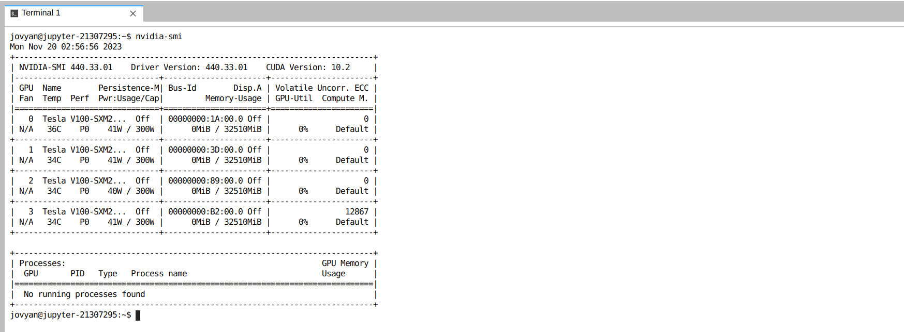
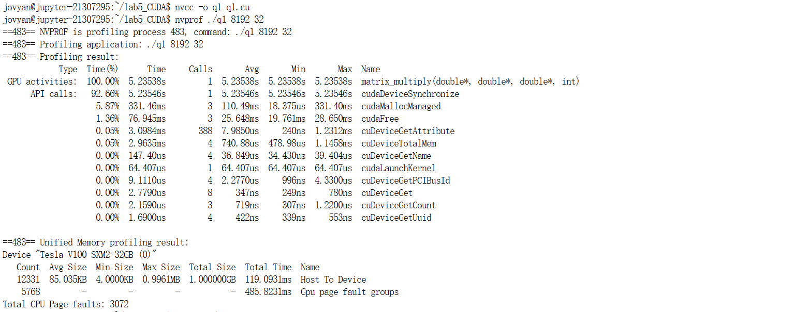
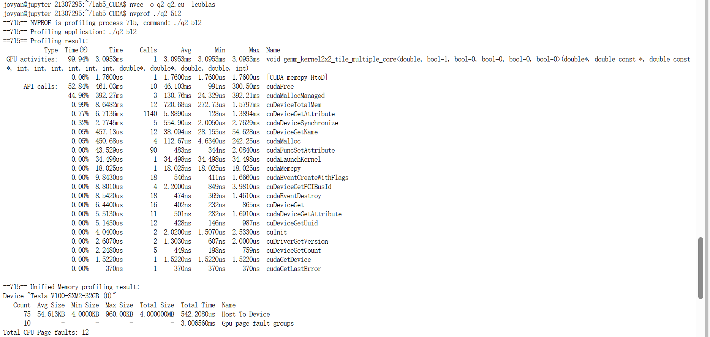
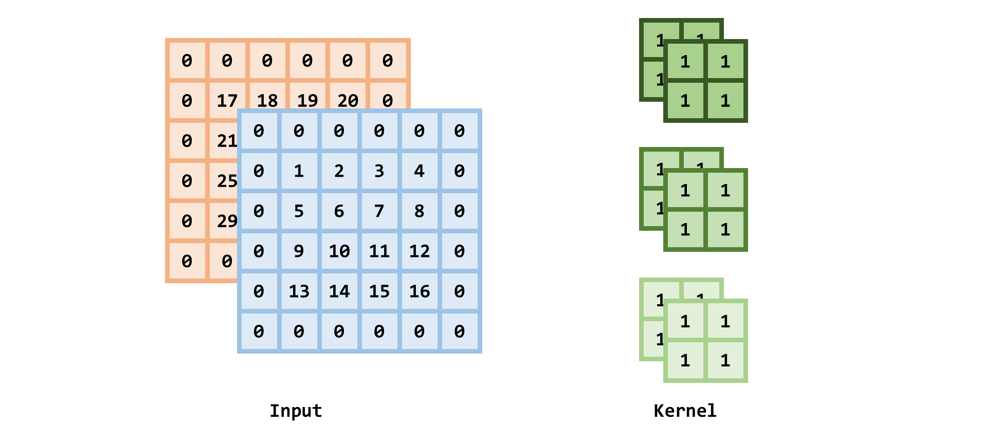
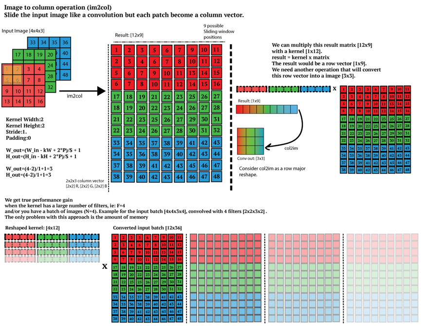
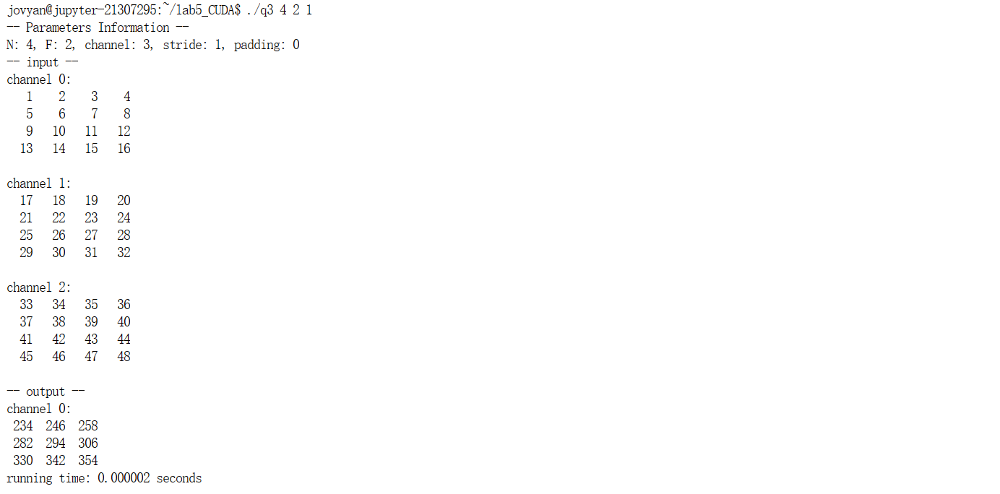
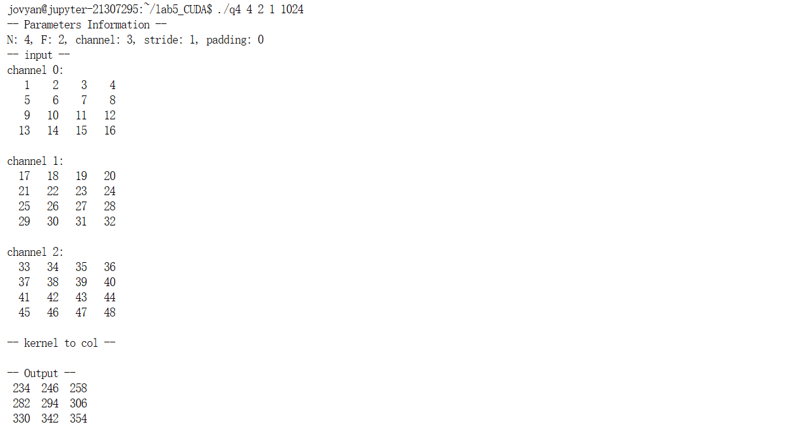
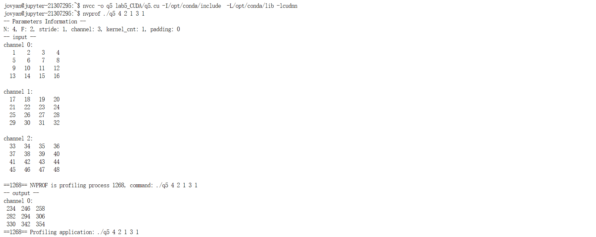

# <center> HPC Lab5-CUDA

## 1. 实验目的
- 掌握 CUDA 编程

## 2. 实验过程和核心代码
输入用户账号密码后，在命令行输入命令 `nvidia-smi` 验证当前环境


### 1. CUDA 矩阵乘法并行化
1. 问题描述：通过 CUDA 实现通用矩阵乘法的并行版本，其中 CUDA Thread Block Size 从32增加到512 
2. 实验过程
   1. 定义矩阵 `a, b, c`，直接通过 `cudaMallocManaged` 让 cuda 申请和托管内存
    ```c
    double *a, *b, *c; 
    size_t n = atoi(argv[1]); 
    size_t size = n * n * sizeof(double);
    int block_size = atoi(argv[2]);       // 32:512

    cudaMallocManaged((void**)&a, size); 
    cudaMallocManaged((void**)&b, size);
    cudaMallocManaged((void**)&c, size);
    ```
   2. 初始化矩阵 `a, b`，这里为了方便后续验证，不采用随机初始化
    ```c
    // initialize host matrix a & b
    for (int i = 0; i < n; i++) {
        for (int j = 0; j < n; j++) {
            *(a + i * n + j) = i + j;
            *(b + i * n + j) = i + j;
        }
    }
    ```
   3. 定义 `block, grid` 的大小，采用一维坐标定义；为了 防止 `n * n` 无法整除 `blockSize.x` 而导致所申请的线程数量无法满足，改为 `(n * n + blockSize.x - 1) / blockSize.x`
    ```c
    dim3 blockSize(block_size); 
    dim3 gridSize((n * n + blockSize.x - 1) / blockSize.x);
    ```
   4. 调用 `matrix_multiply` 核函数
    ```c
    matrix_multiply<<<gridSize, blockSize>>>(a, b, c, n);
    ```
   5. 实现 `matrix_multiply`: 输入参数为矩阵 `a, b, c` ，以及矩阵的大小 `n * n`（此处简化为方阵计算）；这里采用每个线程 **只计算一个单元** 的方式，即 `c_ij = a_ik * b_kj`；其中为了让每个线程得知自己计算的位置，需要通过所在的索引与矩阵所在的位置进行一个映射，即我们先计算出线程在所有线程中的索引: `block` 的索引乘上 `block` 的大小加上 线程在 `block` 中的索引： `idx = blockIdx.x * blockDim.x + threadIdx.x`，之后得到所要计算的行号 `row` 列号 `col`；具体程序如下：
    ```c
    __global__ void matrix_multiply(double* a, double* b, double* c, int n) {
        int idx = blockIdx.x * blockDim.x + threadIdx.x;

        if (idx < n * n) {
            int row = idx / n; 
            int col = idx % n;

            double sum = 0.0;
            for (int i = 0; i < n; ++i) {
                sum += a[row * n + i] * b[i * n + col];
            }
            c[row * n + col] = sum;
        }
    }
    ```
   6. 由于使用了 `cudaMemoryManaged`， 为了保证所有线程计算完成，需要以下语句同步
    ```c
    cudaDeviceSynchronize();
    ```
   7. 释放内存
    ```c
    cudaFree(a);
    cudaFree(b);
    cudaFree(c);
    ```
3. 实验验证：通过如下指令编译运行
   ```shell
   nvcc -o q1 q1.cu
   nvprof ./q1 [matrix size] [cuda thread block size]
   ```
   可以看到运行成功，且我们可以通过 `nvprof` 的信息得知程序各个部分所运行的时间
   

### 2. CUBLAS 矩阵乘法
1. 问题描述：通过 NVIDIA 的矩阵计算函数库 CUBLAS 计算矩阵相乘，矩阵规模从512增加至8192，并与任务1和任务2的矩阵乘法进行性能比较和分析，如果性能不如CUBLAS，思考并文字描述可能的改进方法

> 参考《计算机体系结构-量化研究方法》第四章
> CUBLAS参考资料《CUBLAS_Library.pdf》，CUBLAS矩阵乘法参考第70页内容。
> CUBLAS矩阵乘法例子，参考附件《matrixMulCUBLAS》

2. 实验过程：
   1. 导入必要的库 `cublas_v2.h`
   ```c
   #include <cstdio>
   #include <cstdlib>
   #include <cuda_runtime.h>
   #include <cublas_v2.h>
   ```
   2. 定义如下变量 `alpha` `beta`，后面会在函数调用中使用到
   ```c
   const double alpha = 1.0;
   const double beta = 0.0;
   ```
   3. 初始化和分配内存，与上一题基本一致
   ```c
   double *a, *b, *c; 
   size_t n = atoi(argv[1]); 
   size_t size = n * n * sizeof(double);

   cudaMallocManaged((void**)&a, size); 
   cudaMallocManaged((void**)&b, size);
   cudaMallocManaged((void**)&c, size);

   // initialize host matrix a & b
   for (int i = 0; i < n; i++) {
      for (int j = 0; j < n; j++) {
            *(a + i * n + j) = i + j;
            *(b + i * n + j) = i + j;
      }
   }
   ```
   4. 调用 `cublasDgemm`: 首先我们需要创建并初始化一个 cublas 句柄 `handle`，用于跟踪 cublas 上下文的对象；之后调用 `cublasDgemm`；其中 `CUBLAS_OP_N` 表示对矩阵 `a, b` 不进行转置操作，之后 `n, n, n` 表示输入矩阵的大小 为 `n * n, n * n`，`alpha = 1` 表示标量，与矩阵 A 和 B 相乘的系数；`beta = 0` 表示 标量，与矩阵 C 相乘的系数；即 `cublasDgemm` 所做的这样的操作
      $$
      C = \alpha  A^{\text{op}} B^{\text{op}} + \beta C
      $$
   ```c
   cublasHandle_t handle;
   cublasCreate(&handle);

   cublasDgemm(handle, CUBLAS_OP_N, CUBLAS_OP_N, n, n, n, &alpha, a, n, b, n, &beta, c, n);

   cudaDeviceSynchronize();
   ```
   5. 销毁内存和句柄
   ```c
   cudaFree(a);
   cudaFree(b);
   cudaFree(c);
   cublasDestroy(handle);
   ```
3. 实验验证：通过如下指令编译运行
   ```shell
   nvcc -o q2 q2.cu -lcublas
   nvprof ./q2 [matrix size] 
   ```
   可以看到运行成功


### 3. 卷积
1. 问题描述：用直接卷积的方式对Input进行卷积，这里只需要实现2D, `height * width`，通道channel(depth)设置为3，Kernel (Filter)大小设置为 3*3 ，步幅(stride)分别设置为1，2，3，可能需要通过填充(padding)配合步幅(stride)完成CNN操作。注：实验的卷积操作不需要考虑bias(b)，bias设置为0；其中输入为 Input 和 Kernel，输出为卷积结果和计算时间
2. 实验过程
   1. 定义变量：`N`: 输入图片的大小，为了方便实现，假设为 `N * N`; `F`: 卷积核的大小 `F * F`; `stride`: 卷积核每次移动的步长; `channel`: 输入的通道数，同时也是单个kernel的深度; `kernel_cnt`: 卷积核的数量，同时也是输出的通道数
      1. 计算 `padding`: 由于有时候计算输出大小时会无法整除，需要在图片周围填充 0 元素来使得 最终输出的大小为整数；因此 `padding` 的计算公式为
         $$
         \text{padding} = \frac{(\text{stride} - N + F)\text{mod stride}}{2}
         $$

         但是由于 C 语言的模运算与数学定义不一致，当为负数模时，结果仍然为负数，例如 `-1 % 3 = -1`，因此将公式更改为
         $$
         \text{padding} = ((\text{stride} - N + F)\text{mod stride} + \text{stride})\text{mod stride} / 2
         $$
      2. 计算输出大小 `output_size`
         $$
         \text{OutputSize} = \frac{N - F + 2\times\text{padding}}{\text{stride}} + 1
         $$
   ```c
   struct timeval start, end;    // 计算时间 <sys/time.h>
   int N = atoi(argv[1]), F = atoi(argv[2]);
   int stride = atoi(argv[3]);
   int channel = atoi(argv[4]); 
   int kernel_cnt = atoi(argv[5]); 
   int padding = (((stride - N + F) % stride + stride) % stride) / 2; 
   int output_size = (N - F + 2 * padding) / stride + 1; 
   printf("-- Parameters Information --\n"); 
   printf("N: %d, F: %d, stride: %d, channel: %d, kernel_cnt: %d, padding: %d\n", 
           N, F, stride, channel, kernel_cnt, padding);
   ```
   2. 定义输入、卷积核核输出，并分配内存
   ```c
   N += 2 * padding;
   double** input = (double**)malloc(channel * sizeof(double*)); 
   double** output = (double**)malloc(kernel_cnt * sizeof(double*));
   double** kernel = (double**)malloc(kernel_cnt * channel * sizeof(double*));
   for (int i = 0; i < channel; i++) {
      input[i] = (double*)malloc(N * N * sizeof(double));
   }
   for (int i = 0; i < kernel_cnt; i++) {
      output[i] = (double*)malloc(output_size * output_size * sizeof(double));
   }
   for (int i = 0; i < kernel_cnt * channel; i++) {
      kernel[i] = (double*)malloc(F * F * sizeof(double));
   }
   ```
   3. 初始化输入和卷积核；为了方便后续验证结果的准确性，我们类似于下图一样初始化输入，同时卷积核统一为全1的矩阵 
   ```c
   // initialize input and kernel
   int offset = (N - 2 * padding) * (N - 2 * padding); 
   for (int c = 0; c < channel; c++) {
      for (int i = 0; i < N; i++) {
         for (int j = 0; j < N; j++) {
            if (i < padding || j < padding || N - i <= padding || N - j <= padding) {
               input[c][i * N + j] = 0; 
            }
            else {
               input[c][i * N + j] = (i - padding) * (N - 2 * padding) + j - padding + 
               1 + c * offset; 
            }
         } 
      }
   }
   for (int d = 0; d < kernel_cnt; d++) {
      for (int c = 0; c < channel; c++) { 
         for (int i = 0; i < F; i++) {
            for (int j = 0; j < F; j++) {
               kernel[d * kernel_cnt + c][i * F + j] = 1.0;
            }
         }
      }
   }
   ```
   4. 进行卷积运算：总体思想就是卷积核在input上按 `stride` 滑动，之后对于一个卷积核在 `channel` 个图片卷积的结果相加，得到对应 output 的一个 channel 的结果；后不断循环得到 output 的所有channel(=kernel_size) 的结果；最后打印运行时间
   ```c
   // convolution
   gettimeofday(&start, NULL);
   for (int d = 0; d < kernel_cnt; d++) {
      for (int c = 0; c < channel; c++) {
         for (int i = 0; i < output_size; i++) {
            for (int j = 0; j < output_size; j++) {
               double sum = 0.0;
               for (int k = 0; k < F; k++) {
                     for (int l = 0; l < F; l++) {
                        sum += input[c][(i * stride + k) * N + j * stride + l] * 
                        kernel[d * kernel_cnt + c][k * F + l]; 
                     }
               }
               output[d][i * output_size + j] += sum; 
            }
         }
      }
   }
   gettimeofday(&end, NULL);
   printf("running time: %f ms\n\n\n", 
          (end.tv_sec - start.tv_sec) * 1e3 + (end.tv_usec - start.tv_usec) / 1e3);
   ```
   5. 释放内存
   ```c
   // free memory
   for (int i = 0; i < channel; i++) {
      free(input[i]);
   }
   free(input); 
   for (int i = 0; i < kernel_cnt; i++) {
      free(output[i]);
   }
   free(output); 
   for (int i = 0; i < kernel_cnt * channel; i++) {
      free(kernel[i]); 
   }
   free(kernel); 
   ```
3. 实验验证：`N` = 7, `F` = 3, `kernel_size` = 1
   - stride: 1 
   ```c
   -- input --
   channel 0: 
    1    2    3    4    5    6    7
    8    9   10   11   12   13   14
   15   16   17   18   19   20   21
   22   23   24   25   26   27   28
   29   30   31   32   33   34   35
   36   37   38   39   40   41   42
   43   44   45   46   47   48   49

   channel 1:
   50   51   52   53   54   55   56
   57   58   59   60   61   62   63
   64   65   66   67   68   69   70
   71   72   73   74   75   76   77
   78   79   80   81   82   83   84
   85   86   87   88   89   90   91
   92   93   94   95   96   97   98

   channel 2:
    99  100  101  102  103  104  105
   106  107  108  109  110  111  112
   113  114  115  116  117  118  119
   120  121  122  123  124  125  126
   127  128  129  130  131  132  133 
   134  135  136  137  138  139  140
   141  142  143  144  145  146  147

   -- output --
   channel 0:
   1566 1593 1620 1647 1674
   1755 1782 1809 1836 1863
   1944 1971 1998 2025 2052
   2133 2160 2187 2214 2241
   2322 2349 2376 2403 2430
   ```
   - stride: 2 
   ```c
   -- input --
   channel 0: 
    1    2    3    4    5    6    7 
    8    9   10   11   12   13   14 
   15   16   17   18   19   20   21 
   22   23   24   25   26   27   28 
   29   30   31   32   33   34   35 
   36   37   38   39   40   41   42 
   43   44   45   46   47   48   49 

   channel 1: 
   50   51   52   53   54   55   56 
   57   58   59   60   61   62   63 
   64   65   66   67   68   69   70 
   71   72   73   74   75   76   77 
   78   79   80   81   82   83   84 
   85   86   87   88   89   90   91 
   92   93   94   95   96   97   98 

   channel 2: 
    99  100  101  102  103  104  105 
   106  107  108  109  110  111  112
   113  114  115  116  117  118  119
   120  121  122  123  124  125  126
   127  128  129  130  131  132  133
   134  135  136  137  138  139  140
   141  142  143  144  145  146  147

   -- output --
   channel 0:
   1566 1620 1674
   1944 1998 2052
   2322 2376 2430
   ```
   - stride: 3 (with padding = 1) 
   ```c
   -- input --
   channel 0: 
      0    0    0    0    0    0    0    0    0
      0    1    2    3    4    5    6    7    0
      0    8    9   10   11   12   13   14    0
      0   15   16   17   18   19   20   21    0
      0   22   23   24   25   26   27   28    0
      0   29   30   31   32   33   34   35    0
      0   36   37   38   39   40   41   42    0
      0   43   44   45   46   47   48   49    0
      0    0    0    0    0    0    0    0    0

   channel 1:
      0    0    0    0    0    0    0    0    0
      0   50   51   52   53   54   55   56    0
      0   57   58   59   60   61   62   63    0
      0   64   65   66   67   68   69   70    0
      0   71   72   73   74   75   76   77    0
      0   78   79   80   81   82   83   84    0
      0   85   86   87   88   89   90   91    0
      0   92   93   94   95   96   97   98    0
      0    0    0    0    0    0    0    0    0

   channel 2:
      0    0    0    0    0    0    0    0    0
      0   99  100  101  102  103  104  105    0
      0  106  107  108  109  110  111  112    0
      0  113  114  115  116  117  118  119    0
      0  120  121  122  123  124  125  126    0
      0  127  128  129  130  131  132  133    0
      0  134  135  136  137  138  139  140    0
      0  141  142  143  144  145  146  147    0
      0    0    0    0    0    0    0    0    0

   -- output --
   channel 0:
    648 1017  708
   1287 1998 1377
   1068 1647 1128
   ```
   可以手动验算，上面的结果都是准确的

### 4. im2col
1. 问题描述：使用im2col方法结合任务1实现的GEMM（通用矩阵乘法）实现卷积操作。输入从256增加至4096或者输入从32增加至512；用im2col的方式对Input进行卷积，这里只需要实现2D, `height * width`，通道channel(depth)设置为3，Kernel (Filter)大小设置为3*3。 注：实验的卷积操作不需要考虑bias(b)，bias设置为0，步幅(stride)分别设置为1，2，3；其中输入为 Input 和 Kernel，输出为卷积结果和计算时间 
2. 实验过程
   1. 与上一题一致的内存申请模式以及初始化方法，不再赘述
   2. 定义和初始化 im2col 后的矩阵运算的两个源矩阵 `a, b` 和目标矩阵 `c`；其中按照上图所示，对于矩阵 `a`，将 kernel 按行排好即可；对于矩阵 `b` ，将每一小轮卷积的元素提取出来，然后转为列向量放到矩阵中；这样直接将 `a * b` 得到的结果矩阵通过 `output_size` 进行重新划分，即可得到卷积结果
   ```c
   // im2col
   double *a, *b, *c; 
   int m = kernel_cnt; 
   int n = channel * F * F;
   int k = output_size * output_size;
   cudaMallocManaged((void**)&a, m * n * sizeof(double));
   cudaMallocManaged((void**)&b, n * k * sizeof(double));
   cudaMallocManaged((void**)&c, m * k * sizeof(double));

   // initialize im2col values 
   gettimeofday(&start, NULL);
   // a: kernel -> col
   for (int d = 0; d < kernel_cnt; d++) {
      for (int c = 0; c < channel; c++) {
         for (int i = 0; i < F * F; i++) {
            a[(d * kernel_cnt + c) * F * F + i] = kernel[d * kernel_cnt + c][i]; 
         }
      }
   }
   
   // b: input -> matrix
   for (int c = 0; c < channel; c++) {
      for (int i = 0; i < output_size; i++) {
         for (int j = 0; j < output_size; j++) {
            for (int p = 0; p < F; p++) {
               for (int q = 0; q < F; q++) {
                  b[(c * F * F + p * F + q) * k + i * output_size + j] = 
                  input[c][(i * stride + p) * N + j * stride + q];
               }
            }
         }
      }
   }
   ```
   3. 进行矩阵相乘，最终打印运算时间
   ```c
   dim3 blockSize(block_size); 
   dim3 gridSize((n * k + blockSize.x - 1) / blockSize.x);
   matrix_multiply<<<gridSize, blockSize>>>(a, b, c, m, n, k); 

   cudaDeviceSynchronize();
   
   gettimeofday(&end, NULL);
   printf("running time: %f ms\n\n\n", 
          (end.tv_sec - start.tv_sec) * 1e3 + (end.tv_usec - start.tv_usec) / 1e3);
   ```
   4. 与任务一类似的矩阵乘法，只是此时矩阵可能不是方阵，则假设 `a, b` 的大小分别为 `m * n, n * k`，算法代码如下
   ```c
   __global__ 
   void matrix_multiply(double* a, double* b, double* c, int m, int n, int k) {
      int row = blockIdx.x * blockDim.x + threadIdx.x;

      if (row < m) {
         for (int col = 0; col < k; col++) {
            double sum = 0.0;
            for (int i = 0; i < n; i++) {
               sum += a[row * n + i] * b[i * k + col];
            }
            c[row * k + col] = sum;
         }
      }
   }
   ```
3. 实验验证：通过如下指令编译运行
   ```shell
   nvcc -o q4 q4.cu
   ./q4 [N] [F] [stride] [channel] [kernel_cnt] [cuda block size] 
   ```
   任务3的运行结果  任务4的运行结果 可以看到 output 矩阵结果一致，说明运算准确

### 5. cuDNN
1. 问题描述：使用cuDNN提供的卷积方法进行卷积操作，记录其相应Input的卷积时间，与自己实现的卷积操作进行比较。如果性能不如cuDNN，用文字描述可能的改进方法
2. 实验过程：
   1. 在 host 上的相关变量，与任务三一致的内存申请模式以及初始化方法，不再赘述
   2. 创建句柄 `cudnn`，用于跟踪 cudnn 上下文的对象
   ```c
   // convolution
   // cuDNN intialization
   cudnnHandle_t cudnn;
   cudnnCreate(&cudnn);
   ```
   3. 创建并设置一个张量描述符 `input_desc`，将用于存储关于 **输入** 张量的信息。接下来，使用 `cudnnCreateTensorDescriptor` 函数为输入张量描述符分配内存；之后，使用 `cudnnSetTensor4dDescriptor` 函数设置输入张量的描述符，其中：
      - `input_desc`: 要设置的张量描述符
      - `CUDNN_TENSOR_NCHW`: 表示张量的格式，此处为 "Number of images, Channels, Height, Width"
      - `CUDNN_DATA_DOUBLE`: 表示张量元素的数据类型 `double`
      - `1`: 表示张量的数量，输入为一张图片，因此为 1
      - `channel`: 表示通道的数量
      - `N`: 表示张量的高度
      - `N`: 表示张量的宽度
   ```c
   cudnnTensorDescriptor_t input_desc;
   cudnnCreateTensorDescriptor(&input_desc);
   cudnnSetTensor4dDescriptor(
      input_desc, CUDNN_TENSOR_NCHW, CUDNN_DATA_DOUBLE, 1, channel, N, N
   );
   ```
   4. 创建并设置一个张量描述符 `filter_desc`，将用于存储关于 **卷积核** 张量的信息
   ```c
   // kernel
   cudnnFilterDescriptor_t filter_desc;
   cudnnCreateFilterDescriptor(&filter_desc);
   cudnnSetFilter4dDescriptor(
      filter_desc, CUDNN_DATA_DOUBLE, CUDNN_TENSOR_NCHW, kernel_cnt, channel, F, F
   );
   ```
   5. 创建并设置一个卷积运算描述符，其中 `cudnnSetConvolution2dDescriptor` 的参数
      - `conv_desc`: 要设置的张量描述符
      - `padding, padding`: 横向和纵向所要填充的个数
      - `stride, stride`: 横向和纵向的移动步长
      - `1, 1`: dilation：膨胀系数，设置为1表示不膨胀
      - `CUDNN_CONVOLUTION`: 选择最常规的卷积操作
      - `CUDNN_DATA_DOUBLE`: 数据类型为 `double`
   ```c
   cudnnConvolutionDescriptor_t conv_desc;
   cudnnCreateConvolutionDescriptor(&conv_desc);
   cudnnSetConvolution2dDescriptor(
      conv_desc, padding, padding, stride, stride, 1, 1, 
      CUDNN_CONVOLUTION, CUDNN_DATA_DOUBLE
   );
   ```
   6. 创建并设置一个张量描述符 `output_desc`，将用于存储关于 **输出** 张量的信息
   ```c
   cudnnTensorDescriptor_t output_desc;
   cudnnCreateTensorDescriptor(&output_desc);
   cudnnSetTensor4dDescriptor(
      output_desc, CUDNN_TENSOR_NCHW, CUDNN_DATA_DOUBLE, 1, 
      kernel_cnt, output_size, output_size
   );
   ```
   7. 创建 device 的变量，然后通过 `cudaMemcpy` 进行从 host 到 device 的值复制
   ```c
   double* d_input;
   double* d_kernel;
   double* d_output;

   cudaMalloc((void**)&d_input, channel * N * N * sizeof(double));
   cudaMalloc((void**)&d_kernel, kernel_cnt * channel * F * F * sizeof(double));
   cudaMalloc((void**)&d_output, kernel_cnt * output_size * output_size * sizeof(double));

   gettimeofday(&start, NULL);
   cudaMemcpy(
      d_input, input, channel * N * N * sizeof(double), cudaMemcpyHostToDevice
   );
   cudaMemcpy(
      d_kernel, kernel, kernel_cnt * channel * F * F * sizeof(double), cudaMemcpyHostToDevice
   );
   ```
   8. 选择卷积算法：`cudnnGetConvolutionForwardAlgorithm` 函数会根据硬件和输入数据的情况返回一个推荐的卷积算法，然后将该算法用于实际的卷积操作，最终计算完复制回 `output`，并打印运行时间
   ```c
   cudnnConvolutionFwdAlgo_t algo;
   cudnnGetConvolutionForwardAlgorithm(
      cudnn, input_desc, filter_desc, conv_desc, output_desc, 
      CUDNN_CONVOLUTION_FWD_PREFER_FASTEST, 0, &algo
   );
   cudnnConvolutionForward(
      cudnn, &alpha, input_desc, d_input, filter_desc, 
      d_kernel, conv_desc, algo, nullptr, 0, &beta, output_desc, d_output
   );

   cudaMemcpy(
      output, d_output, 
      kernel_cnt * output_size * output_size * sizeof(double), 
      cudaMemcpyDeviceToHost
   );
   gettimeofday(&end, NULL);
   
   printf("running time: %f ms\n\n\n", 
          (end.tv_sec - start.tv_sec) * 1e3 + (end.tv_usec - start.tv_usec) / 1e3);
   ```
   9. 释放内存和销毁相关描述符
   ```c
   // free memory
   cudnnDestroyTensorDescriptor(input_desc);
   cudnnDestroyFilterDescriptor(filter_desc);
   cudnnDestroyConvolutionDescriptor(conv_desc);
   cudnnDestroyTensorDescriptor(output_desc);
   cudnnDestroy(cudnn);
   cudaFree(d_input);
   cudaFree(d_kernel);
   cudaFree(d_output);
   ```
3. 实验验证：
   ```shell
   nvcc -o q5 q5.cu -I/opt/conda/include -L/opt/conda/lib -lcudnn
   ./q5 [N] [F] [stride] [channel] [kernel_cnt]
   ```
    可以看到与任务三、四的结果一致，说明运行正确

## 3. 实验结果
### 1. CUDA 矩阵乘法并行化
```shell
nvcc -o q1 q1.cu
./q1 [matrix_size] [cuda_thread_block_size]
```

- 矩阵规模设置为 `8192 * 8192`，其中 CUDA Thread Block Size 从32增加到512，以下是 核函数 `matrix_multiply` 的运行时间（单位：ms）

   | CUDA Block Size |   32    |   64    |   128   |   256   |   512   |
   | :-------------: | :-----: | :-----: | :-----: | :-----: | :-----: |
   | matrix_multiply | 5235.38 | 5188.43 | 5193.32 | 5193.17 | 5140.42 |

### 2. CUBLAS 矩阵乘法
```shell
nvcc -o q2 q2.cu -lcublas
./q2 [matrix_size]
```

- 矩阵规模从 `512` 到 `8192`；单位 ms (其中任务一的 `block_size` = 1024)
   |   Matrix Size   |  512   |  1024  |  2048  |  4096  |  8192   |
   | :-------------: | :----: | :----: | :----: | :----: | :-----: |
   | matrix_multiply | 2.4047 | 9.9039 | 47.761 | 628.67 | 5163.20 |
   |   cublasDgemm   | 3.0953 | 9.9285 | 34.683 | 110.49 | 407.59  |
- 可以看到一开始，当矩阵规模较小的时候，自己设计的矩阵算法比较快；但是到了后面矩阵规模较大的时候性能就远远不如 `cublasDgemm`
  - 原因
    - 每次计算一个点都要访问一次矩阵 `a, b`，访存次数过多，效率低；
    - 每次每个线程只是计算一个点的矩阵乘法结果，可能导致创建线程的开销比计算开销还大，导致性能浪费
    - 对于矩阵 `b` 的读取，由于矩阵乘法的设计，不是连续访存，而是跳跃访存
  - 改进方法
    - 将矩阵 `a, b` 搬运到 GPU Shared Memory 上，以减小访存开销
    - 每次每个线程计算一个矩阵块，提升线程性能
    - 将矩阵 `b` 进行转置，这样每次读取矩阵 `a, b` 都是按行的连续访存

### 3/4/5. 卷积 / im2col / CUDNN

```shell
gcc -o q3 q3.c
nvcc -o q4 q4.cu
export LD_LIBRARY_PATH=/opt/conda/lib:$LD_LIBRARY_PATH
nvcc -o q5 q5.cu -I/opt/conda/include -L/opt/conda/lib -lcudnn

./q3 [N] [F] [stride] [channel] [kernel_cnt]
./q4 [N] [F] [stride] [channel] [kernel_cnt] [cuda block size] 
                                                # set cudablocksize = 1963 on trial
./q5 [N] [F] [stride] [channel] [kernel_cnt]
```

- 输入图片规模从 32 到 512，通道数为 3；卷积核数量为1，大小为 `3 * 3`；`stride` 测试 1，2，3； 单位: ms
   |  method \ N   |  32   |  64   |  128  |  256   |  512   |
   | :-----------: | :---: | :---: | :---: | :----: | :----: |
   | **stride: 1** |
   |   original    | 0.345 | 1.487 | 6.101 | 20.507 | 41.680 |
   |    im2col     | 0.217 | 0.747 | 3.071 | 12.492 | 49.799 |
   |     cudnn     | 0.295 | 0.144 | 0.279 | 0.795  | 2.815  |
   | **stride: 2** |
   |   original    | 0.087 | 0.373 | 1.536 | 6.229  | 16.157 |
   |    im2col     | 0.067 | 0.210 | 0.845 | 3.226  | 12.781 |
   |     cudnn     | 0.162 | 0.191 | 0.210 | 0.547  | 1.834  |
   | **stride: 3** |
   |   original    | 0.039 | 0.187 | 0.704 | 2.922  | 8.145  |
   |    im2col     | 0.061 | 0.128 | 0.410 | 1.652  | 5.913  |
   |     cudnn     | 0.149 | 0.199 | 0.202 | 0.501  | 1.030  |
- 可以看到 cudnn 的卷积运行时间几乎都比任务三、四的运行时间短；可以改进的地方如下
  - 任务四的 im2col 的转换时间可能占了很大一部分开销，这部分实际上也可以通过 GPU 并行化实现，因为访问和写入转换矩阵 `b` 的 `for` 不存在数据相关
  - im2col后的矩阵乘法也需要改进
    - 将矩阵 `a, b` 搬运到 GPU Shared Memory 上，以减小访存开销
    - 每次每个线程计算一个矩阵块，提升线程性能
    - 将矩阵 `b` 进行转置，这样每次读取矩阵 `a, b` 都是按行的连续访存
