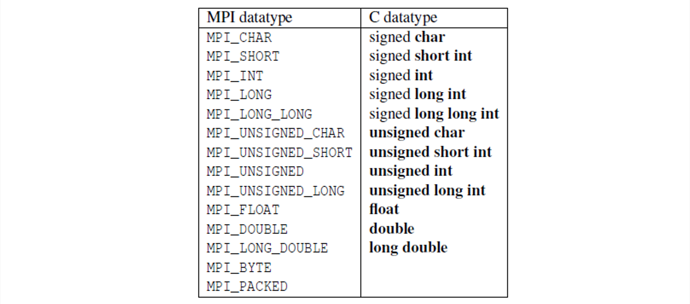
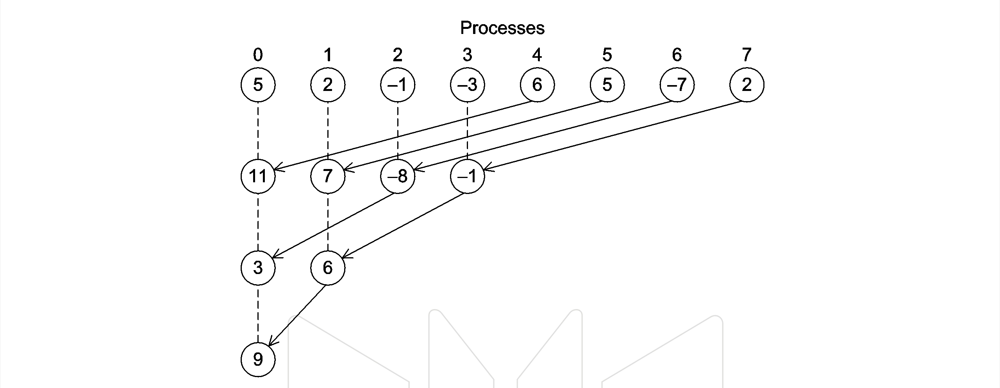
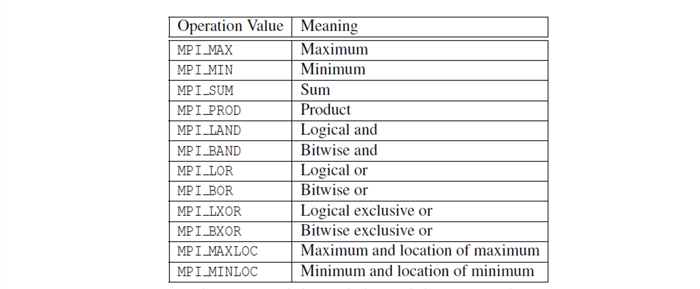
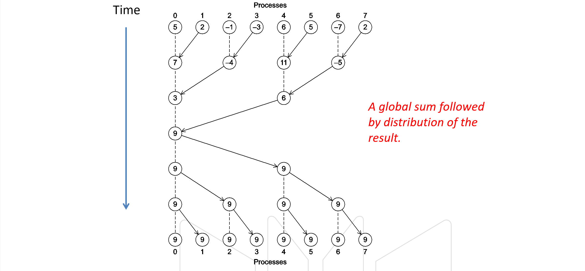
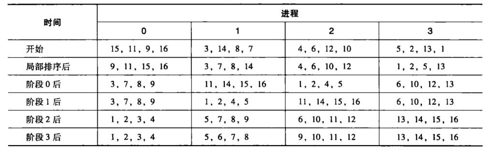

# 03 Distributed Memory Programming with MPI
## 1. MPI 基础知识
1. Hello World!
   ```c
   #include <stdio.h>
   #include <string.h>
   #include <mpi.h>

   const int MAX_STRING = 100;

   int main(void) {
      char    greeting[MAX_STRING]; 
      int     comm_sz;        // number of processes 
      int     my_rank;        // my process rank

      MPI_Init(NULL, NULL); 
      MPI_Comm_size(MPI_COMM_WORLD, &comm_sz); 
      MPI_Comm_rank(MPI_COMM_WORLD, &my_rank); 

      if (my_rank != 0) {     // client
         sprintf(greeting, "Greetings from process %d of %d!", my_rank, comm_sz); 
         MPI_Send(greeting, strlen(greeting) + 1, MPI_CHAR, 0, 0, MPI_COMM_WORLD);
      }
      else {                  // server
         printf("Greeting from process %d of %d!\n", my_rank, comm_sz); 
         for (int q = 1; q < comm_sz; q++) {
            MPI_Recv(greeting, MAX_STRING, MPI_CHAR, q, 0, MPI_COMM_WORLD, MPI_STATUS_IGNORE); 
            printf("%s\n", greeting); 
         }
      }

      MPI_Finalize(); 
      return 0;
   }
   ```
2. 编译与执行
   1. 编译：`mpicc -o mpi_hello mpi_hello.c`
   2. 执行：`mpiexec -n <number of process> ./mpi_hello`
      ```shell
      mpiexec -n 1 ./mpi_hello
      mpiexec -n 4 ./mpi_hello
      ```
3. 初始化和结束
   1. `MPI_Init`: 告知 MPI 系统进行所有必要的初始化 `int MPI_Init(int* argc, char*** argv)`
   2. `MPI_Finalize`: 为了告知 MPI 系统 MPI 已经使用完毕，为 MPI 而分配的任何资源都可以释放了 `int MPI_Finalize(void)`
4. 通信子
   1. 通信子：指的是一组可以互相发送消息的进程集合 `MPI_COMM_WORLD`
   2. `MPI_Comm_size`: 进程数量
   3. `MPI_Comm_rank`: 介于 0 和 size - 1, 用来标识进程
5. `MPI_Send`: 进程用于发送消息，其中第一个参数是指向消息内容的一个指针，然后第二个和第三个指定了消息的大小，其中数据类型需要根据MPI给定的来写：；第四个参数是要发送给的目的进程的进程号；第五个参数用于区分消息；第六个一般填 `MPI_COMM_WORLD`
   ```c
   int MPI_Send(
      void*         msg_buf_p,     // in
      int           msg_size,      // in
      MPI_Datatype  msg_type,      // in
      int           dest,          // in
      int           tag,           // in
      MPI_Comm      communicator   // in
   ); 
   ```
6. `MPI_Recv`: 进程用于接收消息，前面6个参数对应于 `MPI_Send` 的参数，其中tag要一致；最后的 `status_p` 一般填写 `MPI_STATUS_IGNORE`
   ```c
   int MPI_Recv(
      void*         msg_buf_p,     // out
      int           buf_size,      // in
      MPI_Datatype  buf_type,      // in
      int           src,           // in
      int           tag,           // in
      MPI_Comm      communicator,  // in 
      MPI_Status*   status_p       // out 
   ); 
   ```
7. 消息匹配：发送和接收成功匹配需要满足以下条件
   1. 首先通信子，收发tag，以及收发方的 进程号要对应
   2. 数据类型要一致
   3. 接收方的缓冲区要大于等于发送方的消息的大小
   4. 可以看到只有接收者可以使用通配符参数。发送者必须指定一个进程号与一个非负整数标签。因此，MPI使用的是所谓的“推”（push）通信机制，而不是“拉”（pull） 通信机制
8. `status_p`
   1. `MPI_Get_count`：用于获取从接收操作中接收到的消息的元素数量。具体而言，它用于查询由 MPI 接收操作（如 MPI_Recv）接收的消息中包含的元素数量
      ```c
      int MPI_Get_count(
         MPI_Status*    status_p,     // in
         MPI_Datatype   type,         // in
         int*           count_p       // out
      ); 
      ```
   2. MPI_Status 是一个有至少三个成员的结构，MPI_SOURCE、MPIJAG 和 MPI-ERROR，那么，将 status 作为最后一个参数传递给 MPI_Recv 函数并调用它后，可以通过检查前面两个变量来确定发送者和标签，不过一般这个信息不是必须的，那么我们没必要为了得到该值浪费一次计算，直接写 `MPI_STATUS_IGNORE`
9. MPI 收发语义：MPI要求消息是**不可超越的**（nonovertaking） 即如果 q 号进程发送了两条消息给 r 号进程，那么q 进程发送的第一条消息必须在第二条消息之前可用。但是，如果消息是来自不同进程的，消息的到达顺序是没有限制的。即如果q 号进程和t号进程都向 r号进程发送了消息，即使q 号进程在t号进程发送消息之前就将自己的消息发送出去了，也不要求 q 号进程的消息在 t 号进程的消息之前一定能被 r 号进程所访问
10. 潜在陷阱：如果一个进程试图接收消息，但没有相匹配的消息，那么该进程将会被永远阻塞在那里，即 **进程悬挂**；简单地说，如果调用 MPI_Send 发生了阻塞，并且没有相匹配的接收，那么发送进程就悬挂起来。另一方面，如果调用 MPI_ Send 被缓冲，但没有相匹配的接收，那么消息将被丢失
11. 输入：大部分的 MPI 实现只允许 MPI_COMM_WORLD 中的 0 号进程访问标准输入stdin

## 2. MPI 实现梯形积分法
1. 梯形积分法原理：将区间等分为 n 个子区间，然后每一子区间部分的积分用梯形近似
2. 伪代码：
   ```c
   // sum of trapezoid areas = h[f(x0) / 2 + f(x1) + ... + f(xn-1) + f(xn) / 2]
   h = (b - a) / n; 
   approx = (f(a) + f(b)) / 2.0; 
   for (i = 1; i <= n - 1; i++) {
      x_i = a + i * h; 
      approx += f(x_i); 
   }
   approx *= h; 
   ```
3. MPI 代码：
   ```c
   #include <stdio.h>
   #include <mpi.h>

   int main(void) {
      int my_rank, comm_sz, n = 1024, local_n; 
      double a = 0.0, b = 3.0, h, local_a, local_b; 
      double local_int, total_int; 
      int src; 

      MPI_Init(NULL, NULL); 
      MPI_Comm_rank(MPI_COMM_WORLD, &my_rank); 
      MPI_Comm_size(MPI_COMM_WORLD, &comm_sz); 

      h = (b - a) / n; 
      local_n = n / comm_sz; 

      local_a = a + my_rank * local_n * h; 
      local_b = local_a + local_n * h; 
      local_int = Trap(local_a, local_b, local_n, h); 

      if (my_rank != 0) { // 其他进程
         MPI_Send(&local_int, 1, MPI_DOUBLE, 0, 0, MPI_COMM_WORLD); 
      }
      else {   // 主进程
         total_int = local_int; 
         for (src = 1; src < comm_sz; src++) {
            MPI_Recv(&local_int, 1, MPI_DOUBLE, src, 0, MPI_COMM_WORLD, MPI_STATUS_IGNORE); 
            total_int += local_int; 
         }
      }

      if (my_rank == 0) {
         printf("With n = %d trapezoids, our estimate \n", n); 
         printf("of the integral from %f to %f = %.15e\n", a, b, total_int); 
      }

      MPI_Finalize(); 
      return 0; 
   }

   double Trap(double left_endpt, double right_endpt, int trap_count, double base_len) {
      double estimate, x;
      int i;
      estimate = (f(left_endpt) + f(right_endpt)) / 2.0
      for (i = 1; i <= trap_count - 1; i++) {
         x = left_endpt + i * base_len;
         estimate += f(x); 
      }
      estimate *= base_len;
      return estimate; 
   } 
   ```

## 3. 集合通信
1. 在 MPI里，涉及通信子中所有进程的通信函数称为**集合通信**为了区分集合通信与类似 MPI_Send 和 MPI_RecV 这样的函数，MPI_Send 和 MPI_Recv 通常称为点对点通信
2. `MPI_Reduce`：这个函数的关键在于第 5 个参数，operator。它的类型为 MPI_Op, 是一个像 MPI_Datatype 和 MPI_Comm一样的预定义 MPI类型。这个类型有多个预定义值
   ```c
   int MPI_Reduce (
      void*        input_data_p, 
      void*        output_data_p, 
      int          count, 
      MPI_Datatype datatype, 
      MPI_Op       operator, 
      int          dest_process, 
      MPI_Comm     comm
   ); 
   ```
   如果 count 参数大于1, 那么 MPI_Reduce 函数可以应用到数组上，例如下面的代码用于一组 N 维向量的加法
   ```c
   double local[N], sum[N]; 
   ...
   MPI_Reduce(local, sum, N, MPI_DOUBLE, MPI_SUM, 0, MPI_COMM_WORLD); 
   ```
3. 集合通信对比点对点通信
   1. 集合通信 在通信子中的所有进程都必须调用相同的集合通信函数
   2. 每个进程传递给 MPI 集合通信函数的参数必须是 “相容的”。例如，如果一个进程将。作为 dest_process 的值传递给函数，而另一个传递的是 1, 那么对 MPI_Reduce 调用所产生的结果就是错误的
   3. 参数 output_data_p 只用在 dest_process 上。然而，所有进程仍需要传递一个与output_data_p 相对应的实际参数
   4. 点对点通信函数是通过标签和通信子来匹配的。集合通信函数不使用标签，只通过通信子和调用的**顺序**来进行匹配
4. `MPI_Allreduce`: 梯形积分法程序中，我们只打印结果，所以只用一个进程来得到全局总和的结果是很自然的。然而，在所有进程都想得到全局总和的结果的情况下，如图，用一棵树来计算全局总和，我们可以通过“颠倒”（reverse） 整棵树来发布全局总和 MPI 提供了 `MPI_AllReduce` 来完成这种蝶形结构；参数表其实与 MPI_Reduce 的是相同的，除了没有dest_process，因为所有进程都要得到结果
   ```c
   int MPI_Allreduce (
      void*         input_data_p, 
      void*         output_data_p, 
      int           count, 
      MPI_Datatype  datatype, 
      MPI_Op        operator, 
      MPI_Comm      comm
   ); 
   ```
5. `MPI_Bcast`: 在一个集合通信中，如果属于一个进程的数据被发送到通信子中的所有进程，这样的集合通信就叫做 **广播**
   ```c
   int MPI_Bcast(
      void*         data_p, 
      int           count, 
      MPI_Datatype  datatype, 
      int           source_proc, 
      MPI_Comm      comm
   ); 
   ```
   进程号为 source_proc 的进程将 data_p 所引用的内存内容发送给了通信子 comm 中的所有进程
6. `MPI_Scatter`: 散射函数，如果通信子 comm 包含 comm_sz 个进程，那么 `MPI_Scatter` 函数会将 send_buf_p 所引用的数据分成 comm_sz 份，第一份给0号进程，第二份给 1 号进程，第三份给2 号进程，以此类推；每个进程应该将它本地的向量作为 recv_buf_p 参数的值；需要注意的是，`send_count` 参数表示的是发送到**每个进程**的数据量，而不是 `send_buf_p` 所引用的内存的数据量
   ```c
   int MPI_Scatter(
      void*         send_buf_p, 
      int           send_count, 
      MPI_Datatype  send_type, 
      void*         recv_buf_p, 
      int           recv_count, 
      MPI_Datatype  recv_type, 
      int           src_proc, 
      MPI_Comm      comm
   ); 
   ```
7. `MPI_Gather`: 聚集函数，在 0号进程中，由 send_buf_p 所引用的内存区的数据存储在 recv_buf_p 的第一个块中，在 1号进程中，由 send_buf_p 所引用的内存区的数据存储在 recv_buf_p 的第二个块里，以此类推。注意， recv_count 指的是**每个进程**接收到的数据量，而不是所有接收到的数据量的总和
   ```c
   int MPI_Gather(
      void*         send_buf_p, 
      int           send_count, 
      MPI_Datatype  send_type, 
      void*         recv_buf_p, 
      int           recv_count, 
      MPI_Datatype  recv_type, 
      int           dest_proc, 
      MPI_Comm      comm
   ); 
   ```
8. `MPI_Allgather`: 全局聚集，这个函数将每个进程的 send_buf_p 内容串联起来，存储到每个进程的 recv_buf_p 参数中；它从每个进程收集数据并将其传播到所有进程，相当于 每个进程都调用 `MPI_Gather` 向根进程发送数据，然后根进程调用 `MPI_Bcast` 广播数据给所有进程
   ```c
   int MPI_Allgather(
      void*         send_buf_p, 
      int           send_count, 
      MPI_Datatype  send_type, 
      void*         recv_buf_p, 
      int           recv_count, 
      MPI_Datatype  recv_type, 
      MPI_Comm      comm
   ); 
   ```

## 4. MPI 程序的性能评估
1. 计时：MPI 提供了 `double MPI_Wtime(void)` 函数，返回从过去某一时刻开始所经过的秒数
   ```c
   double start, end; 
   ...
   start = MPI_Wtime(); 
   ...
   end = MPI_Wtime();
   printf("Proc %d > Elapsed time = %e seconds\n", rank, end - start);
   ```
2. `MPI_Barrier(MPI_COMM)`: 确保同一个通信子中的所有进程都完成调用该函数之前，没有进程能够提前返回

## 5. 并行排序算法
1. 冒泡排序
   ```c
   // bubble sort
   for (int i = 0; i < n - 1; i++) {
      for (int j = 0; j < n - 1 - i; j++) {
         if (a[j] > a[j + 1]) {
            int temp = a[j]; 
            a[j] = a[j + 1]; 
            a[j + 1] = temp; 
         }
      }
   }
   ```
2. 奇偶交换排序
   1. 一串阶段的序列
   2. 偶数阶段: 比较交换对 `(a[0], a[1])`, `(a[2], a[3])`, `(a[4], a[5])` ... 
   3. 奇数阶段: 比较交换对 `(a[1], a[2])`, `(a[3], a[4])`, `(a[5], a[6])`...
      ```c
      for (int phase = 0; phase < n; ++phase) {
         if (phase % 2 == 0) {   // even phase
            for (int i = 1; i < n; i += 2) {
               if (a[i - 1] > a[i]) {
                  swap(a[i - 1], a[i]); 
               }
            }
         }
         else {   // odd phase
            for (int i = 1; i < n - 1; i += 2) {
               if (a[i] > a[i + 1]) {
                  swap(a[i], a[i + 1]); 
               }
            }
         }
      }
      ```
3. 并行奇偶交换排序：一个阶段内的所有比较和交换可以并行执行；我们根据进程数量划分待排序数组；然后在一个进程内部的子数组采用快排；之后进行奇偶组之间的交换排序 

