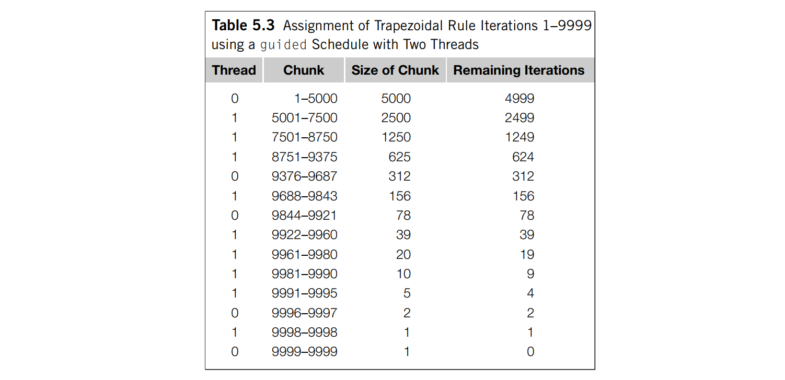

# 05 OpenMP
## 1. OpenMP 基础知识
1. Hello World!
   ```c
   #include <stdio.h>
   #include <stdlib.h>
   #include <omp.h>

   void Hello(void) {
      int rank = omp_get_thread_num(); 
      int thread_count = omp_get_num_threads();
      printf("Hello from thread %d of %d\n", rank, thread_count); 
   }

   int main(int argc, char* argv[]) {
      int thread_count = strtol(argv[1], NULL, 10);
      
      #pragma omp parallel num_threads(thread_count)
      Hello(); 

      return 0; 
   }
   ```
2. 编译运行 
   ``` shell
   gcc -fopenmp -o omp_hello omp_hello.c
   ./omp_hello <number of threads>
   ```
3. 注意到 OpenMP 提供基于指令的共享内存 API，即通过预处理指令 `#pragma` 来执行并行化代码，后面跟着的基本块被多个线程并行执行；在 OpenMP 中，子句是一些用来修改基本指令的文本：例如 `num_threads` 子句添加到 `parallel` 命令后，就允许程序员指定执行后代码块的线程数量
   ```c
   # pragma omp parallel num_threads(thread_count)
   ```
   需要注意的是，程序可以启动的线程数可能会受系统定义的限制。OpenMP 标准并不保证实际情况下能够启动 `thread_count` 个线程；当代码块执行完时，即上面的例子中，当线程从 `Hello` 调用中返回时，有一个**隐式路障**，使得完成代码块的线程将等待线程组中的所有其他线程完成代码块
4. `int omp_get_thread_num(void)`: 获取当前线程的编号（从 `0` 到 `thread_count - 1`）
5. `int omp_get_num_threads(void)`: 获取线程数量
6. 临界区互斥：使用 `critical` 指令，确保一次只有一个线程执行
   ```c
   # pragma omp critical
   global_sum += local_sum; 
   ```
7. 归约 reduction：将相同的归约操作符重复地应用到操作数序列来得到一个结果的计算，所有操作的中间结果存储在同一个变量里：归约变量。OpenMP中可以添加 reduction 子句；例如，代码明确了 global_result 是一个归约变量，加号 `(+)` 指示归约操作符是加法
   ```c
   global_result = 0.0; 
   # pragma omp parallel num_threads(thread_count) \
            reduction(+: global_result)
   global_result += func(...); 

   // equal to: 
   global_result = 0.0; 
   # pragma omp parallel num_threads(thread_count) {
      double local_result = func(...); 
      # pragma omp critical
      global_result += local_result; 
   }
   ```
   OpenMP 支持的操作符有 `+, - , * , &, |, ^, &&, ||`
8. `parallel for`: 在 `parallel for` 指令之后的结构化块必须是 for 循环。另外，运用`parallel for` 指令，系统通过在线程间划分循环迭代来并行化 for 循环；注意。OpenMP只支持并行化典型结构的 `for` 循环，如不支持以下条件，编译器会简单拒绝
   1. 变量 index 必须是整型或者指针，且只能被 `for` 语句中的增量表达式修改
   2. 表达式 `start, end, incr` 必须兼容类型，且在循环内不能改变
      ```c
      # pragma omp parallel for num_threads(thread_count) \
               reduction(+: global_sum)
      for (i = 0; i < n; i++) 
         global_sum += func(...); 
      ```
      在一个已经被 `parallel for` 指令并行化的 for 循环中，线程间的缺省划分方式是由系统决定的。大部分系统会粗略地使用块划分
9. 循环依赖：在一个迭代中计算，其结果在之后的迭代中使用；`parallel_for` 并不会处理这种循环依赖
   1. `private`：用于保证变量为私有变量，加入 `private` 子句
   2. `shared`：用于保证变量是公有变量，加入 `shared` 子句
   3. `default(none)`: 强制程序员显式地声明所有变量的共享属性，而不允许OpenMP根据默认规则自动推断
      ```c
      double sum = 0; 
      # pragma omp parallel for num_threads(thread_count) \
               default(none) reduction(+: sum) private(i, factor) \
               shared(n)
      for (i = 0; i < n; i++) {
         if (k % 2 == 0) factor = 1.0; 
         else factor = -1.0; 
         sum += factor / (2 * i + 1); 
      }
      ```

## 2. 循环调度
1. 循环调度：一个好的迭代分配能够对性能有很大的影响。在 OpenMP 中，将循环分配给线程称为调度，通过 `schedule` 子句实现
2. `schedule(<type>, chunksize)`：`chunksize` 是一个正整数，表示一个线程连续执行多少个块；`type` 类型可以为：
   1. `static`: 迭代能够在循环执行前分配给线程；如果缺省`chunksize` ，近似等于 `total_iterations / thread_count`
   2. `dynamic` 和 `guided`: 迭代在循环执行时被分配给线程，因此在一个线程完成了它的当前迭代集合后，它能从运行时系统中请求更多；缺省 `chunksize` 等于1；对于 `guided` 类型，每次动态分配剩余迭代次数的一半 
   3. `auto`: 编译器和运行时系统决定调度方式
   4. `runtime`: 调度在运行时决定

## 3. 互斥和同步
1. `critical`: 使用 `critical` 指令，确保一次只有一个线程执行
   ```c
   # pragma omp critical
   global_sum += local_sum; 
   ```
   OpenMP 还支持给临界区命名，以区分不同的临界区：`#pragma omp critical(name)`
2. `atomic`: 与 `critical` 指令略有不同，它只能保护由一条 C 语言赋值语句所形成的临界区。此外，语句必须是以下几种形式之一
   ```c
   x <op>= <expression>;   // <op> = {+, *, -, /, &, ^, | <<, >>}
   x++; 
   ++x; 
   x--; 
   --x; 
   ```
   例如
   ``` c
   # pragma omp atomic
   ++x; 
   ```
3. OpenMP 简单锁的类型是 `omp_lock_t`， 定义简单锁的函数包括
   ```c
   void omp_init_lock(omp lock t* lock p /* out */);        // 初始化锁
   void omp_set_lock(omp lock t* lock p /* in/out */);      // 加锁
   void omp_unset_lock(omp lock t* lock p /* in/out */);    // 解锁
   void omp_destroy_lock(omp lock t* lock p /* in/out */);  // 销毁锁
   ```
   因此临界区的实现
   ```c
   # pragma omp critical
   /* q_p = msg queues[dest] */
   Enqueue(q_p, my rank, msg);
   
   // can be replaced with

   /* q_p = msg queues[dest] */
   omp_set_lock(&q_p−>lock);
   Enqueue(q_p, my rank, msg);
   omp_unset_lock(&q_p−>lock);
   ```