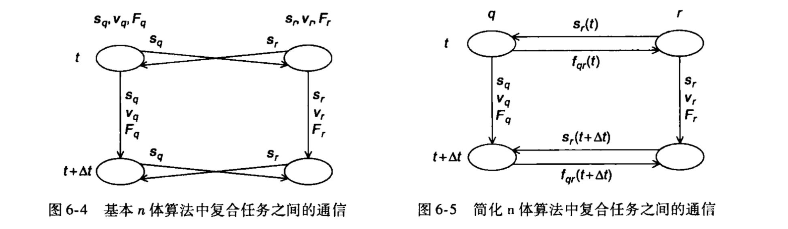

# 06 Parallel Program Development
## 1. n 体问题
1. n 体问题：找出一段时间内相互作用的物体集合的位置和速度，n代表系统中的物体数量
2. 循环划分（Loop Partitioning）： 在循环划分中，计算任务通常通过对物体或时间步骤进行迭代的循环来表达。并行化的思想是将这个循环划分成若干个小的子循环，每个子循环由一个处理单元负责执行。这样，不同处理单元可以并行地处理不同的循环迭代
3. 块划分（Block Partitioning）： 块划分是指将整个计算区域划分成块，每个块由一个处理单元负责。每个块通常包含一组物体，并且每个处理单元负责计算这些物体之间的相互作用 
4. n体问题的基本算法采用块划分法会有更好的性能。对于简化算法，循环划分可以使得在计算作用力时的负载更为均衡。然而采用该划分方法带来的提升需要与共享内存环境下缓存性能的降低、分布式内存环境下额外的通信负载相权衡

