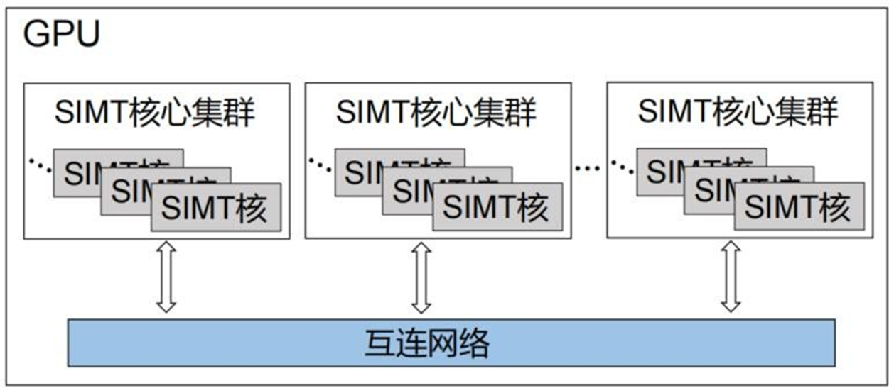
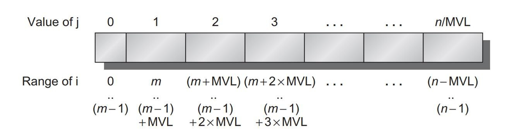
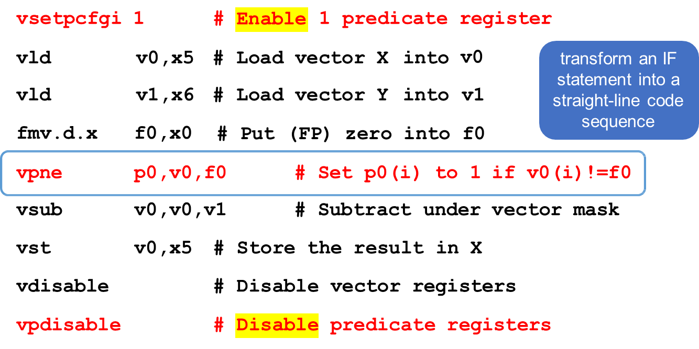

# 07 GPU Architectures
1. Flynn分类法：为了解决原有分类方法的缺点，Flynn提出了一种基于数据流和指令流的并行性关系的分类方法
   1. 指令流：指机器执行的指令序列，即将一系列将数据送入数据处理单元进行修改的命令
   2. 数据流：指由指令流调用的数据序列，包括输入数据和中间结果，但不包括输出数据
   3. 多倍性：指在系统性能瓶颈部件上处于同一执行阶段的指令或数据的最大可能个数 
2. 基于指令和数据划分

   |    | single instruction | multiple instruction |
   |:--:|:------------------:|:--------------------:|
   | single data  | SISD(传统冯诺依曼计算机)     | MISD(很少)         |
   | multiple data| SIMD(向量计算机)     | MIMD(多处理器,多计算机系统) |

3. SISD：一种传统的串行计算机；它从硬件上就不支持任何并行化计算，所有的指令都是串行执行；在一个时钟周期内只能执行一条数据流，因此这种机器被称为单指令单数据流机器  
4. SIMD：可以实现数据级并行，对多个不同的数据流并行执行相同的数据处理操作 
   1. 该类型计算机主要适用于解决使用向量和矩阵等复杂科学计算和大规模工程计算的问题
   2. 这类机器大多应用于数字信号处理、图像处理等领域，SIMD根据类型又可以分为阵列计算机和向量计算机
      1. 阵列计算机：用一个单一的控制单元提供信号驱动多个处理单元同时运行
      2. 向量计算机：指专门对向量进行处理的计算机；它主要是以流水线结构为主，以向量作为基本操作单元，操作数和结果都以向量的形式存在
      3. 阵列计算机和向量计算机的区别
         1. 数据并行性：阵列计算机以数据并行为主，将任务分配给多个处理器，每个处理器独立执行相同操作的不同数据元素。每个处理器通过独立处理多个数据元素来实现并行计算；向量计算机则通过执行相同的操作来同时处理大型连续数据向量，具有更高的数据并行性
         2. 硬件架构：阵列计算机通常是通过大量的相同处理器节点组成的，每个节点都有自己的本地存储器，可以独立访问和处理数据；向量计算机则具有特殊的硬件向量寄存器，可以在单个指令周期内同时处理整个向量。它们通常具有更高的数据带宽和更强大的浮点性能
         3. 编程模型：阵列计算机通常使用数据并行语言或库来编写程序，例如MATLAB和CUDA等。程序员需要显式地指定数据元素之间的并行性和通信操作；向量计算机则具有专门的向量指令集和编程模型
      4. SIMT：一种并行计算中使用的模型，主要是将SIMD与多线程结合在一起，广泛应用于GPU上的计算单元中 
         1. SIMT比SIMD灵活：SIMT允许一条指令的多数据分开寻址；SIMD是必须连续在一起的片段；SIMT 可以支持编写线程级的并行代码，而 SIMD 不支持编写线程级的代码
         2. SIMD中的向量中元素相互之间可以自由通信；SIMD的向量存在于相同的地址空间；SIMT中的每个线程的寄存器都是私有的；SIMT线程之间只能通过共享内存和同步机制进行通信
5. MISD：每个处理器都按照不同指令流的要求来对同一个数据流以进行不同的处理；存在一定争议，有人认为这种类型的计算机至今都未出现；也有其他人认为有一些类似的例子，例如共享内存的多处理器系统和计算机中的流水线结构
6. MIMD：每个处理器都有自己的指令流，也可以和其他处理器共享指令流，对自己的数据进行处理；这是最广泛应用的并行体系结构的形式，现代流行的并行处理结构都可以划分为这一类

## 1. SIMD architecture
1. SIMD: 单指令多数据流：大多数指令有可以并行的数据操作
2. SIMD 优点
   1. 可以开发出重要的数据级并行
   2. 比MIMD更简单有效
   3. 允许编程人员以序列化的方式进行思考
3. SIMD并行框架
   1. 向量架构等
   2. GPU(SIMT)
4. 向量架构：将一组数据元素读入“向量寄存器”，对这些寄存器进行操作，将结果分散回内存；其中寄存器由编译器控制，用于隐藏内存延迟，高效利用内存带宽，如RV64V
   1. 向量寄存器：每个寄存器保存一个 包含 32 个元素，每个元素 64 位的向量；register file有 16 个读端口和 8 个写端口。register file 是中央处理单元 (CPU) 中的处理器寄存器阵列
   2. 向量功能单元：FP 加法和乘法，完全流水线化；检测数据和控制冒险
   3. 向量load-store单元：完全流水线化
   4. 标量寄存器：31个通用寄存器，32个浮点寄存器，提供数据作为向量功能单元的输入，计算要传递给向量加载/存储单元的地址
5. 向量架构的优化
   1. **多车道技术**：使用多个功能单元执行同一向量指令 
   2. 向量长度寄存器
      1. 在实际编程的时候，特定向量的长度在编译阶段可能是未知的，解决方法是增加一个向量长度寄存器，用于控制向量的长度
      2. strip mining：假设向量处理器可以一次处理的最大向量长度为 `mvl`，那么如果向量的长度 `n` 大于 `mvl` 的时候，我们需要进行长度的切分 其中 `m` = `n % mvl`，即切分为：最开始的长度是余数长度的向量，后面的都是 `mvl` 长度的向量
   3. 向量遮罩（mask）寄存器：主要用于应对循环中的 `if` 语句
      ```c
      for (i = 0; i < 64; i++) {
         if (x[i] != 0) {
            x[i] = x[i] - y[i]; 
         }
      }
      ```
      1. 遮罩寄存器会维护一个 mask（即一个布尔向量），当mask被设置好时，所有后续向量指令仅对寄存器中的条目为 1 的向量元素进行操作 
   4. **memory banks**：向量的存储读出需要高带宽，因此可以将memory划分为多个memory banks，以供单独处理和控制memory
      1. bank busy time：连续访问同一bank之间的最短时间间隔
      2. memory bank conflict：当对于同一个bank的访问速度快于bank busy time时，就会发生冲突停顿 
      3. **最小bank memory数量** $N$ 计算：假设有 $p$ 个处理器，每个处理器平均每次产生 $n$ 条指令，处理器周期时间为 $t_{proc}$，存储器的bank busy time 为 $t_{DRAM}$，则
      $$
      \min N = p \times n \times \frac{t_{DRAM}}{t_{proc}}
      $$
         
   5. 步长stride: 获取到同一单个向量寄存器时元素之间的距离；例如
      ```c
      for (i = 0; i < 100; i++) {
         for (j = 0; j < 100; j++) {
            for (k = 0; k < 100; k++) {
               /*
                假设bc是按行存储
                那么对于 b，访问元素的stride = 1
                但是对于 c，访问元素的stride = 100
                */
               a[i][j] += b[i][k] * c[k][j]
            }
         }
      }
      ```
      1. 访问非顺序内存位置并将其重塑为密集结构的能力是向量体系结构的主要优势之一
      2. 选取到不合适的stride可能会导致频繁访问同一memory bank，从而导致memory bank conflict
   6. 处理稀疏矩阵等类似的稀疏的数据结构：在稀疏矩阵中，大部分元素为0，即不需要参与计算的
      1. index vectors: 告知矩阵的哪些位置是有元素的，可以维护一个索引向量 `k` `m`
         ```c
         // suppose that a and c: sparse matrix
         for (i = 0; i < n; i++) {
            a[k[i]] += c[m[i]]; 
         }
         ```
      2. gather-scatter 
         1. gather: 通过index vector来获取稀疏矩阵上的非零元素，之后以稠密形式进行操作运算
         2. scatter: 在以稠密形式对这些元素进行操作后，可以使用相同的index vector通过分散存储以扩展形式存储到稀疏矩阵
   7. 向量体系结构编程：程序结构会影响实际性能
6. roofline 模型
   1. 计算密度: 每个字节所需的浮点操作数量 
   2. roofline 模型：将浮点计算的表现和内存吞吐放在一起，其中Y轴是浮点计算性能的表现 = `min(Peak Memory Bandwidth * 计算强度, 峰值浮点计算性能)`，X轴式计算强度 

## 2. GPUs – Graphical Processing Units
1. GPU架构
   1. 异构执行：CPU 为 host，GPU 为 device
   2. 开发出类 C 语言以提供 API ：CUDA、OpenCL
   3. 统一所有并行化操作为 CUDA thread
   4. SIMT：单指令多线程
2. threads, blocks & grids
   1. thread：一个线程与每个数据元素相关联（注意不同于操作系统的thread的定义）threads组织成为blocks，blocks组织成为grid 
   2. grid: 一个grid为一组block
   3. block：一个block被分配到一个SIMD多线程处理器上
   4. warp：32个线程组成一个warp，在单个SIMD处理器上调度至多32个warp，每个warp有自己的PC，根据定义，warp之间没有数据依赖，从而实现流水线来隐藏memory latency 
3. GPU 与 向量架构的关系
   1. 相同点：都是数据级并行；都有scatter-gather、遮罩寄存器、超多寄存器
   2. 不同点：GPU 舍弃了标量寄存器，采用多线程，有更多的功能单元，而不像向量架构的流水线功能单元
4. 通过GPU线程块的调度器将编程模型的分配方式转换为GPU设备上的分配方式  
5. GPU memory结构
   1. private memory：每个SIMD车道拥有私有的off-chip DRAM，不互相共享
   2. local memory(shared memory)：每个SIMD处理器有local memory，在一个block内多个车道或者线程内共享，与其他SIMD处理器不共享
   3. GPU memory(global memory)：全局memory，可以全局共享，host也可以读取和写GPU memory 
6. 条件分支
   1. 内部掩码寄存器：内部掩码寄存器用于标识每个SIMD（单指令多数据）通道的条件分支。每个条目包含每个SIMD通道的掩码，即哪些线程提交它们的结果（所有线程都执行）
   2. 分支同步堆栈： 分支同步堆栈包含了每个执行通道的掩码条目。这些掩码指示分支何时分叉为多条执行路径，并在路径汇聚时充当屏障，用于同步线程
   3. 指令标记：用于管理分支何时分岔为多个执行路径的指令标记。在分支分叉时，将掩码推送到堆栈上，而在路径汇聚时，充当屏障，然后将其从堆栈中弹出
   4. 每个线程通道的1位预测寄存器：由程序员指定的每个线程通道的1位预测寄存器，用于表示条件分支的真假

## 3. loop-level parallelism
1. 循环间依赖
   1. 没有循环间依赖
      ```c
      for (int i = 0; i < 1000; i++)
         x[i] = x[i] + s;  
      ```
   2. 循环间依赖：可以看到 `a, b` 数组都需要用到上一个循环的数据，因此存在循环间依赖
      ```c
      for (int i = 0; i < 1000; i++) {
         a[i + 1] = a[i] + c[i]; 
         b[i + 1] = b[i] + a[i + 1];
      }
      ```
   3. 将循环间依赖转换为循环内依赖
      ```c
      for (int i = 0; i < 100; i++) {
         a[i] = a[i] + b[i]; 
         b[i + 1] = c[i] + d[i]; 
      }

      /* transform to:  */

      a[0] = a[0] + b[0];
      for (int i = 0; i < 99; i++) {
         b[i + 1] = c[i] + d[i]; 
         a[i + 1] = a[i + 1] + b[i + 1]; 
      }
      b[100] = c[99] + d[99]; 
      ```
   4. 进一步改造为可并行化代码（去除循环间和循环内依赖）
      ```c
      a[0] = a[0] + b[0]; 
      for (int i = 1; i < 100; i++) {
         a[i] += c[i - 1] + d[i - 1]; 
         b[i]  = c[i - 1] + d[i - 1]; 
      }
      ```
2. 寻找依赖相关
   1. 假设 store `a * i + b`, 然后 load from `c * i + d`
   2. 如果循环间依赖存在，那么 `gcd(a, c)` 必须整除 `(d - b)`
      ```c
      for (i = 0; i < 100; i++) {
         x[2 * i + 3] = x[2 * i] * 5; 
      }

      // a = 2, b = 3, c = 2, d = 0
      // gcd(a, c) = 2, d - b = -3
      // 2 cannot divide -3, no dependence is possible
      ```
   3. 循环间依赖最重要的形式之一是递归，可以采用reduction解决
      ```c
      for (i = 0; i < 100; i++) {
         sum = sum + x[i] * y[i]; 
      }

      /* transform to: */
      for (i = 0; i < 100; i++) {
         sum[i] = x[i] * y[i];      // no dependence
      }
      for (i = 0; i < 100; i++) {
         finalsum = finalsum + sum[i]; 
      }
      ```