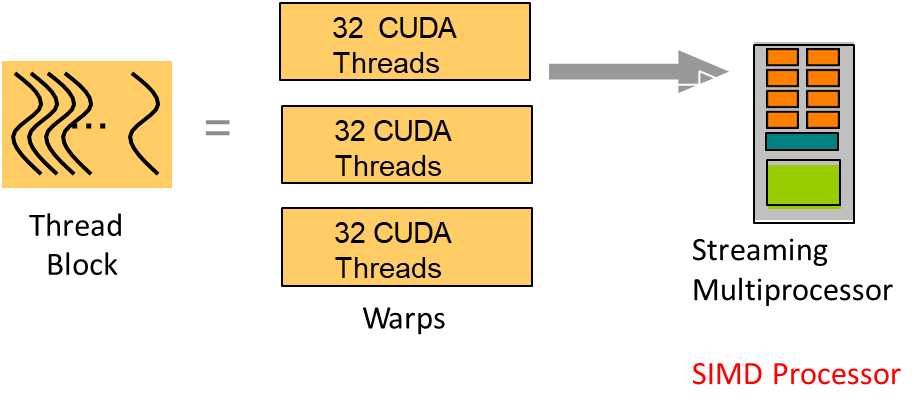
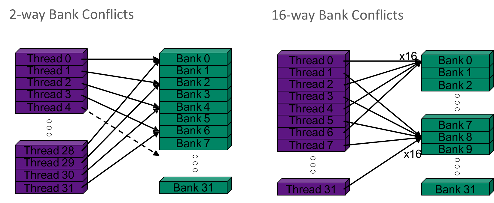
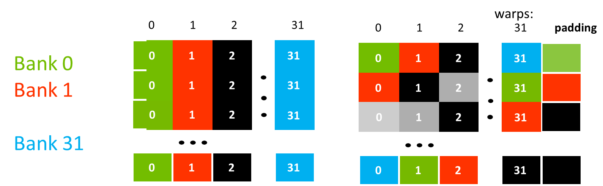

# 08 CUDA
## 1. CUDA C++ BASICs
1. CUDA：CUDA架构为通用计算提供 GPU 并行性；而CUDA C++基于行业标准 C++，是支持异构编程的一组扩展，拥有用于管理设备、内存等的简单 API
2. 异构计算
   1. host: CPU 与其memory
   2. device: GPU 与其 memory
   3. 从CPU memory拷贝数据到GPU memory中，然后载入到GPU程序中并执行，最终通过PCIe或者NV link Bus把GPU计算的结果从GPU memory拷贝到CPU memory上
3. GPU kernel: `__global__` 用于在GPU上构建函数：在host上编程，然后host调用，之后device 执行
   ```cpp
   __global__ void mykernel(void) {
      // ...
   }
   ```
   1. `nvcc` 将源代码分为host部分和device部分；host 部分在 `main`， device 部分在 `kernel` 
   2. 调用 kernel: `mykernel<<<1, 1>>>();` 在 `<<< , >>>` 中，前者指代分配block的数量，后者指代分配thread的数量
4. 内存管理
   1. `cudaMalloc()`: 类似于 c 的 `malloc()` 一样分配内存
   2. `cudaFree()`: 类似于 c 的 `free()` 一样释放内存
   3. `cudaMemcpy()`: 类似于 c 的 `memcpy()` 一样拷贝数据
      ```c
      const int N = 512; 

      int *a, *b, *c; 
      int *d_a, *d_b, *d_c; 
      int size = N * sizeof(int);
      
      cudaMalloc((void**)&d_a, size); 
      cudaMalloc((void**)&d_b, size); 
      cudaMalloc((void**)&d_c, size); 

      a = (int*)malloc(size); random_ints(a, N); 
      b = (int*)malloc(size); random_ints(b, N); 
      c = (int*)malloc(size); 

      cudaMemcpy(d_a, a, size, cudaMemcpyHostToDevice); 
      cudaMemcpy(d_b, b, size, cudaMemcpyHostToDevice); 

      mykernel<<<N, 1>>>(d_a, d_b, d_c); 

      cudaMemcpy(d_c, c, size, cudaMemcpyHostToDevice);

      free(a); free(b); free(c); 
      cudaFree(d_a); cudaFree(d_b); cudaFree(d_c); 
      ```

## 2. CUDA Shared Memory
1. `kernel<<<N, 1>>>(...)`: 使用 `blockIdx.x` 访问当前 block 索引；使用 `threadIdx.x` 访问当前block 的当前thread的索引；`blockDim` 用于获取当前block的维度信息，可以通过 `blockDim.x`、`blockDim.y`、`blockDim.z` 来访问线程块在各个维度上的大小
2. shared memory：在块内，线程通过shared memory共享数据，shared memory相当于用户管理的缓存：应用程序显式分配和访问它。是极快的片上存储器，由用户管理，只能从块内的所有 CUDA 线程访问
3. 将数据从device memory加载到shared memory，与块中的所有其他线程同步，以便每个线程都可以安全地读取由不同线程填充的shared memory位置，处理shared memory中的数据；如有必要，再次同步以确保shared memory已更新为结果，将结果写回设备内存。

## 3. CUDA Optimization
1. 执行模型：CUDA的线程由一个SIMD处理器上的车道并行执行；在多处理器中，线程块被分为warps并且每个warp在一个处理器执行（SIMT）；当线程块数量大于处理器数量时，会有多个并发线程块驻留在一个处理器上；一个核作为线程块组成的一个grid启动
2. Warps：一个线程块由一些Warps组成，一个Warp包含32个线程，一个Warp物理上在一个处理器上可以并行执行 
3. Launch Configuration
   1. 需要足够的线程总数来保持 GPU 繁忙；通常希望每个 SIMD 处理器有 512 个以上的 CUDA 线程（目标是 2048 - 最大“占用率”）
   2. 线程块配置
      1. 每个块的线程数应该是 warp 大小 (32) 的倍数
      2. SIMD处理器可以同时执行至少16个线程块（Maxwell/Pascal/Volta/Ampere：32）；非常小的线程块会妨碍实现良好的占用率；真正大的线程块灵活性较差；通常可以使用 128-256 个线程/块，但使用最适合应用程序的值
4. GPU memory 操作优化
   1. load分为caching和Non-caching模式；caching模式首先检查L1 cache是否命中，然后再L2，memory，每次load 128byte的数据；Non-caching模式直接检查L2，再memory（如果L1有相应数据直接无效化），每次load 32byte的数据
   2. store：无效化L1，L2写回
   3. caching load：每次load 128 bytes 的数据
      1. 如果一个warp正好需要128 bytes 数据，且L1 cache载入的128 bytes数据线恰好就是warp全部需要的，那么利用率100%
      2. 如果一个warp正好需要128 bytes 数据，但是跨越了L1 cache载入的128 bytes数据线，即cache要载入两次才能满足warp，那么利用率50%
      3. 如果一个warp所有线程都只访问同一个4 bytes的数据，那么利用率只有 4/128 = 3.125%
      4. 如果一个warp随机访问128bytes，假设其需要cache载入N次，那么利用率 1/N
   4. 对于 non-caching load：每次载入32 bytes数据，如果一个warp随机访问128bytes，假设其需要cache载入N次，那么利用率 4/N
5. Shared Memory：在一个块内供块内线程间访问，缓存数据以减少对global memory的访问
   1. 组成：多个memory bank，以实现并行访问存储器
   2. bank conflict 
   3. 例子：32 * 32 的 shared memory，那么左侧的bank分布不利于按列访问，会持续产生conflict，右侧的bank分布加入padding，使得bank分布错位，以减少按行和按列访问的bank conflict 

